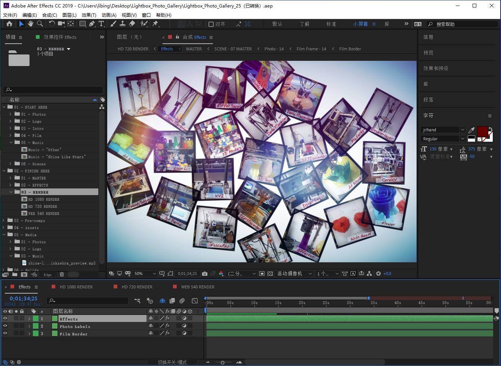

<!-- more -->
<The rest of contents | 余下全文>

使用“Lightbox Photo Gallery”AE模板放入照片制作相册视频。

* Lightbox Photo Gallery by SUPER-8 | VideoHive  
https://videohive.net/item/lightbox-photo-gallery/11698645

## 问题记录

### 字体下载

* 字体天下-提供各类字体的免费下载和在线预览服务  
http://www.fonts.net.cn/

### logo制作
* YEELOGO_logo在线制作  
http://yeelogo.com/#/

### 标题和简介信息没有正确展示

* Lightbox Photo Gallery - After Effects Project Files - The logo and intro messages do not unfold properly. How do I fix this problem?  
https://videohive.net/item/lightbox-photo-gallery/11698645/faqs/26366

### 镜头模糊虚焦插件缺失
* AE/Pr插件：镜头模糊虚焦插件 Fast Camera Lens Blur v4.1.0 Win大众脸破解-LookAE.com  
http://www.lookae.com/lens-blur-41/

