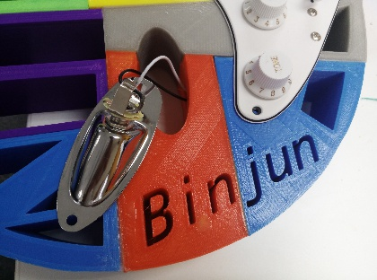
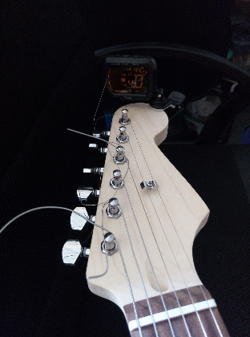

** {{ title }}：** <Excerpt in index | 首页摘要>
涉及制作一把电吉他：  
琴体部分完全采用FDM3D打印制作……  
~~多图预警~~
<!-- more -->
<The rest of contents | 余下全文>

## 展示

  

## 模型
* Stratocaster/Les Paul Hybrid Guitar by TheWhaleBiologist - Thingiverse   
https://www.thingiverse.com/thing:352349

TheWhaleBiologist大神的模型是一个琴体整体，并提供了可使用Inventor修改的.ipt原始文件。  
我在琴体模型上添加了自己的logo，并将整个模型切分成22个小块，便于使用不同颜色进行打印。

* Guitar by Binjun - Thingiverse  
https://www.thingiverse.com/thing:3709391

  

## 准备
  

除了琴体外，还需要购买电吉他的其他配件。在某宝上可以购买到整套电吉他的DIY组装材料，主要包括：  
* 琴颈
* 弦准
* 压弦扣
* 琴弦
* 连接加强板
* 下驹后盖板
* 尾钉
* 护板
* 琴码
* 拾音器等电子配件

  

工具准备
* 手钻
* 胶水(502、AB胶、亚克力胶水)
* 打磨工具（锉刀、剪刀、美工刀）
* 螺丝刀

## 组装

1.用胶水和剪刀将3D打印出来的塑料小块进行粘贴拼接，完成琴体的制作。

  

2.在上弦枕底部涂抹胶水粘在指板的开槽处。  
3.组装弦准，在琴头上打孔安装旋钮和压弦扣。

  

4.连接琴柄和3D打印琴体，调整好琴柄和琴体开槽处的尺寸和高度，根据加强板螺丝孔的位置开孔，用螺丝将琴柄、琴身和加强板连在一起。

  

5.将电路部分连接好，预留接地线和音频输出线，安装护板。

 

6.安装琴码。  

 

7.焊接插座线，安装插座片。  

  

  

8.安装下驹在琴体背面的部件，焊接好接地线并固定好弹簧。

  

  

9.安装琴弦并调音，摇把只是摆设可以不装。

  

10.买个琴箱，完成。

  

## 一些乐理知识

### 有效弦长 Scale Length
有效弦长是弦枕与第12品之间长度的二倍，这段长度也正好是一个八度的音程，琴桥的位置也由此确定，即琴桥必须调整到一个正确的位置，让这把琴得到一个正确的有效弦长。

## 其他

* 3D打印电吉他 撩妹技能Get起来！|3D学堂|3D虎  
http://www.3dhoo.com/news/xuetang/39430.html

