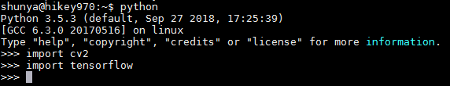

** {{ title }} ** <Excerpt in index | 首页摘要>
hello hikey!
编译安装opencv4.0.0  
<!-- more -->
<The rest of contents | 余下全文>

# 编译安装opencv4.0.0
## 准备

查看ip
``` bash
$ ip addr
```

调整系统默认python版本
``` bash
$ sudo update-alternatives --install /usr/bin/python python /usr/bin/python2.7 1
$ sudo update-alternatives --install /usr/bin/python python /usr/bin/python3.5 2
$ update-alternatives --config python
$ python
```

电源管理中关屏保  
更新源
``` bash
$ sudo apt-get update
$ sudo apt-get upgrade
```
### 相关依赖
``` bash
$ sudo apt-get install build-essential pkg-config
$ sudo apt-get install cmake
$ sudo apt-get install libjpeg-dev
$ sudo apt-get install libtiff5-dev
$ sudo apt-get install libpng12-dev
$ sudo apt-get install libpng-dev
$ sudo apt-get install libavcodec-dev libavformat-dev libswscale-dev libv4l-dev
$ sudo apt-get install libxvidcore-dev libx264-dev
$ sudo apt-get install libgtk2.0-dev
$ sudo apt-get install libatlas-base-dev gfortran
$ sudo apt-get install python3-dev
```

``` bash
$ sudo apt-get install libjasper-dev
```
libjasper-dev安装可能会报错，原因是Arm64架构的版本目前还没有被Debian官方收录，可以通过直接下载deb文件安装，注意相关依赖和包的冲突。


删除与libjpeg-turbo8冲突的包
``` bash
$ sudo apt-get --purge remove libturbojpeg0
$ sudo apt-get --purge remove libjpeg62-turbo-dev
$ sudo apt --fix-broken install
```
下载相关包并按依赖关系依次安装
``` bash
$  wget https://launchpad.net/~ubuntu-security/+archive/ubuntu/ppa/+build/5255502/+files/libjpeg-turbo8_1.3.0-0ubuntu1.1_arm64.deb
$ sudo dpkg -i libjpeg-turbo8_1.3.0-0ubuntu1.1_arm64.deb
$ wget http://launchpadlibrarian.net/152841589/libjpeg8_8c-2ubuntu8_arm64.deb
$ sudo dpkg -i libjpeg8_8c-2ubuntu8_arm64.deb
$ wget http://launchpadlibrarian.net/376191785/libjasper1_1.900.1-debian1-2.4ubuntu1.2_arm64.deb
$ sudo dpkg -i libjasper1_1.900.1-debian1-2.4ubuntu1.2_arm64.deb
$ wget http://launchpadlibrarian.net/376191781/libjasper-dev_1.900.1-debian1-2.4ubuntu1.2_arm64.deb
$ sudo dpkg -i libjasper-dev_1.900.1-debian1-2.4ubuntu1.2_arm64.deb
```
相关下载地址
* arm64 build of libjpeg-turbo 1.3.0-0ubuntu1.1 : Private PPA for Ubuntu Security Team : “Ubuntu Security Team” team  
https://launchpad.net/~ubuntu-security/+archive/ubuntu/ppa/+build/5255502


### 下载opencv源码
``` bash
$ cd Workplace/opencv/
$ wget https://github.com/opencv/opencv/archive/4.0.0.zip
$ unzip 4.0.0.zip
$ wget https://github.com/opencv/opencv_contrib/archive/4.0.0.zip
$ unzip 4.0.0.zip
```
下载比较慢，建议提前下好后上传

### 设置编译环境
安装cmake-qt-gui，使用图形界面  
使用MobaXterm时，CMake界面可以弹出  
``` bash
$ mkdir build
$ cd build/
$ sudo apt-get install cmake-qt-gui
$ cmake-gui
```

选择源文件路径，编译文件夹选择刚才新建的build文件夹
点击左下角Configure，默认Generator为Unix Makefile，完成后界面变红

然后查找OPENCV_EXTRA_MODULES_PATH项，将OpenCV_Contrib-4.0.0/modules的路径填进去，点击左下角Configure，如图


开启python接口选项，注意PYTHON3的参数，路径没有问题BUILD_opencv_python3会自动生成。  
勾选INSTALL_PYTHON_EXMAPLES
再次点击Configure


生成编译文件时，face_landmark_model.dat可能下载不了，所以提前将其下载，并放入./cache/data/文件夹下，重命名为7505c44ca4eb54b4ab1e4777cb96ac05-face_landmark_model.dat
* face_landmark_model.dat 下载地址  
https://raw.githubusercontent.com/opencv/opencv_3rdparty/8afa57abc8229d611c4937165d20e2a2d9fc5a12/face_landmark_model.dat


然后就可以生成编译文件了，点击Generate

### 调整SWAP分区

``` bash
$ cd /var && ls
```
创建一个swap文件,如果已经有swap就卸载它
``` bash
$ sudo swapoff swap 
```
删除swap虚拟内存文件:
``` bash
$ rm /var/swap
```
使用dd命令创建一个文件，of后面跟你需要创建swap的位置
``` bash
$ sudo dd if=/dev/zero of=swap bs=1M count=4096
```
格式化为swap文件
``` bash
$ sudo mkswap swap 
```
装载新的swap文件
``` bash
$ sudo swapon swap 
$ htop
```
可以在htop中看到swap分区大小为4GB，完成  
注意每次reboot后swap分区不会自动挂载

## 编译
确定一下swap分区
``` bash
$ htop
```

键入下述命令开始编译
``` bash
$ sudo make -j4
```
安装
``` bash
$ sudo make install 
$ sudo ldconfig
```

因编译后的库文件cv2.so生成位置为usr/local/python/cv2/python-3.5/cv2.cpython-35m-aarch64-linux-gnu.so，或者在~/Workplace/opencv/opencv-4.0.0/build/lib/python3/cv2.cpython-35m-aarch64-linux-gnu.so，这将导致该模块在Python3中无法import进来，将其拷贝到python3的第三方库文件夹dist-packages下并添加软链接
``` bash
$ sudo cp /usr/local/python/cv2/python-3.5/cv2.cpython-35m-aarch64-linux-gnu.so /usr/local/lib/python3.5/dist-packages
$ cd /usr/local/lib/python3.5/dist-packages/
$ ls
$ sudo ln -s cv2.cpython-35m-aarch64-linux-gnu.so cv2.so
```

import cv2 没有报错，则安装正常



### 问题：ImportError: numpy.core.multiarray failed to import  
出现这个错误的原因是numpy的版本太低了
``` bash
$ pip3 install -U numpy
```


### 创建虚拟环境

``` bash
$ pip3 install virtualenv
$ virtualenv
-bash: virtualenv: command not found
$ sudo apt-get install python-virtualenv
$ virtualenv
-bash: virtualenv: command not found
$ sudo find / -name virtualenv
$ /home/shunya/.local/bin/virtualenv py35 -p /usr/bin/python3
$ source ~/python-env/py35/bin/activate
```


### 测试_人体姿态点检测
``` bash
$ pip3 install scipy
$ cd Workplace/pose/
$ python main.py
```

## 参考资料
* face_landmark_model.dat 下载地址 - dspeia的博客 - CSDN博客  
https://blog.csdn.net/qq_34806812/article/details/82501999
* hikey970学习-011 hikey970上安装opencv - Mingyong_Zhuang的技术博客 - CSDN博客  
https://blog.csdn.net/qqqzmy/article/details/82855377
