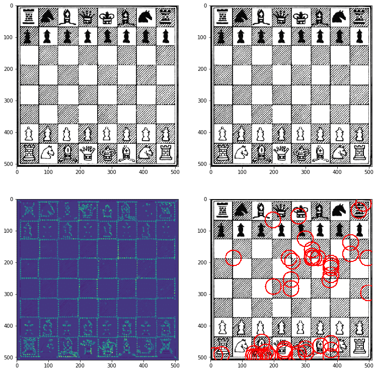
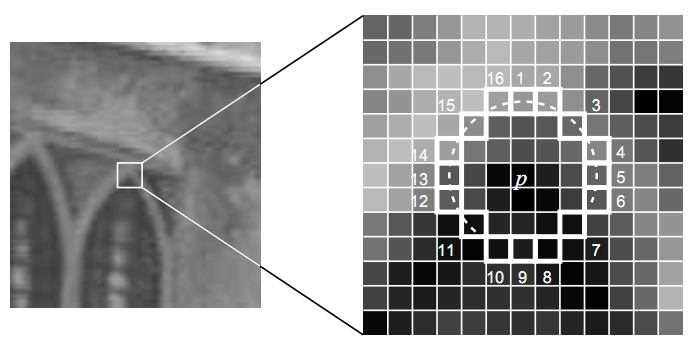
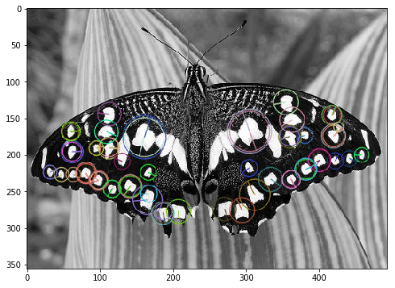
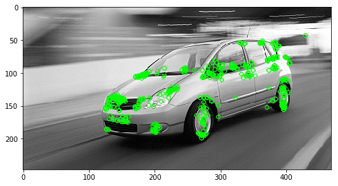
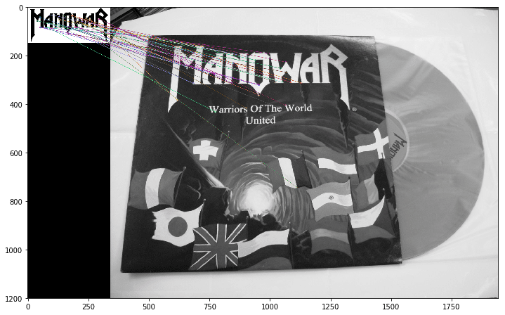

** {{ title }} ** <Excerpt in index | 首页摘要>
## 特征检测算法

* Harris     角点检测
* Shi-Tomasi 角点检测
* FAST       角点检测
* SIFT       斑点（blob）检测
* SURF       斑点检测
* BRIEF      斑点检测
* ORB (Oriented FAST and Rotated BRIEF)

<!-- more -->
<The rest of contents | 余下全文>

### Harris

角点定义：如果某一点在任意方向的一个微小变动都会引起灰度很大的变化，那么这个点就称之为角点。  
Harris角点检测的核心思想就是用一个局部窗口在图像上进行移动来判断灰度的变化，如果变化大于一个值那么就认为这个点是角点。  
将窗口向各个方向移动$(u, v)$然后计算所有差异的总和。表达式如下 

$$
E(u, v)= \underbrace{w(x, y)}_{\text { window function }}[\underbrace{I(x+u, y+v)}_{\text { shifted intensity }}-\underbrace{I(x, y)}_{\text { intensity }}]^{2}
$$

窗口函数$w(x,y)$可以是正常的矩形窗口也可以是对每一个像素给予不同权重的高斯窗口。  角点检测中要使 $E(u,v)$ 的值最大。  
使用泰勒展开和二次型，$E(u,v)$可以近似于  
$$E(u,v) \approx \left[ \begin{matrix}u\,v
\end{matrix}\right]  M \left[ \begin{matrix}
    u \\
    v \\ 
\end{matrix}\right]$$
其中 
$$M = \sum_{x, y} w(x, y)\left[ \begin{matrix}
    I_xI_x\quad I_xI_y \\
    I_xI_y\quad I_yI_y \\ 
\end{matrix}\right] $$

这里 $I_x$ 和 $I_y$ 是图像在 $x$ 和 $y$ 方向的导数,可以使用函数 cv2.Sobel()
计算得到。  
根据下式中的$R$值判定窗口内是否包含角点
$$R=det(M)- \alpha (trace(M))^2 $$
其中$\lambda_1$ 和 $\lambda_2$ 是矩阵 $M$ 的特征值，$\alpha$是一个经验常数，取值为$[0.04, 0.06]$。  
根据R值可以判断一个区域是否是角点，边界或者是平面。  
* 当 $\lambda_1$ 和 $\lambda_2$ 都小时，$|R|$ 也小，对应图像中的平滑区域；
* 当 $\lambda_1 \gg \lambda_2$ 或者 $\lambda_1 \ll \lambda_2$ 时， $R$ 小于0，对应图像中的边缘；
* 当 $\lambda_1$ 和 $\lambda_2$ 都很大时，$R$ 也很大，对应图像中的角点。


```python
import matplotlib.pyplot as plt
import numpy as np
import cv2

%matplotlib inline

img = cv2.imread('./images/chess_board.png')
img_copy = np.copy(img)
img_copy = cv2.cvtColor(img_copy, cv2.COLOR_BGR2RGB)
plt.figure(figsize=(10,10))

plt.subplot(221)
plt.imshow(img)
plt.subplot(222)
plt.imshow(img_copy)

img_gray = cv2.cvtColor(img_copy, cv2.COLOR_BGR2GRAY)
img_gray = np.float32(img_gray)
# 检测角点，定义串口大小为2，梯度计算的索贝尔核函数大小为3，alpha设置为0.04
img_dst = cv2.cornerHarris(img_gray, 2, 3, 0.04)
# 对图像做膨胀处理，加强角点
img_dst = cv2.dilate(img_dst, None)
plt.subplot(223)
plt.imshow(img_dst)

# 定义阈值，用于与R相比较
thresh = 0.7 * img_dst.max()
img_corner = np.copy(img)
# 遍历每一个像素，如果大于阈值，则认为为角点并画在图上
for j in range(img_dst.shape[0]):
    for i in range(img_dst.shape[1]):
        if img_dst[j, i] > thresh:
            cv2.circle(img_corner, (i, j), 25, (255,0,0), 1)
plt.subplot(224)
plt.imshow(img_corner)
plt.subplots_adjust(bottom=.01, top=.99, left=.01, right=.99)
```




```python
%time
import matplotlib.pyplot as plt
import numpy as np
import cv2

%matplotlib inline
plt.figure(figsize=(8, 8))

# filename = './images/blox.jpg'
filename = './images/chessboard.png'
img = cv2.imread(filename)
gray = cv2.cvtColor(img, cv2.COLOR_BGR2GRAY)
gray = np.float32(gray)
img_dst = cv2.cornerHarris(gray, 2, 3, 0.05)

# result is dilated for marking the corners, not important
img_dst = cv2.dilate(img_dst, None)

# Threshold for an optimal value, it may vary depending on the image.
# img[dst>0.07*dst.max()]=[0,0,255]
thresh = 0.2 * img_dst.max()

# 遍历每一个像素，如果大于阈值，则认为为角点并画在图上
for j in range(img_dst.shape[0]):
    for i in range(img_dst.shape[1]):
        if img_dst[j, i] > thresh:
            cv2.circle(img, (i, j), 25, (255,0,0), 1)

img_show = cv2.cvtColor(img, cv2.COLOR_BGR2RGB)
plt.imshow(img_show)
```


### Shi-Tomasi 
Harris角点的打分公式为
$$R=det(M)- \alpha (trace(M))^2 $$
Shi-Tomasi 使用的打分公式为
$$R=min(\lambda_1, \lambda_2)$$
如果打分超过阈值，我们就认为它是一个角点。


```python
import numpy as np
import cv2
from matplotlib import pyplot as plt

%matplotlib inline
plt.figure(figsize=(8, 8))

img = cv2.imread('./images/blox.jpg')
gray = cv2.cvtColor(img,cv2.COLOR_BGR2GRAY)

corners = cv2.goodFeaturesToTrack(gray, 50, 0.01, 10)
# N个最佳角点 = cv2.goodFeaturesToTrack(灰度图, 数量N, 角点质量, 两个角点见最小欧式距离)
corners = np.int0(corners)

for i in corners:
    x,y = i.ravel()
    cv2.circle(img, (x,y), 3, 255, -1)

plt.imshow(img)
plt.show()
```


### FAST
FAST 算法比其它角点检测算法都快。但是在噪声很高时不够稳定，这是由阈值决定的。  
原理：FAST特征检测算法来源于corner的定义，这个定义基于特征点周围的图像灰度值，检测候选特征点周围一圈的像素值，如果候选点周围领域内有足够多的像素点与该候选点的灰度值差别够大，则认为该候选点为一个特征点。
$$N = \sum_{x\, \forall \, circles(p)}|I(x)-I(p)|>\epsilon_d $$
步骤：  
1）在图像中任选一点$p$,假定其像素（亮度）值为$I_p$;  
2）以$r$为半径画圆，覆盖$p$点周围的$M$个像素,如下图所示: $r=3， M=16$;  

3）设定阈值$t$，如果这周围的16个像素中有连续的$N$个像素的像素值减去$I_p$大于$t$,或者有连续的$N$个像素都大于$I_p+t$,则认为$p$为角点。
如果$t=0$，那么就可以理解为：有连续N个像素大于或小于$I_p$的灰度值。那么这个点就被判断为角点。  

为了获得更快的结果，还采用了额外的加速办法。  
如果测试了候选点周围每隔90度角的4个点，应该至少有3个和候选点的灰度值差足够大，否则则不用再计算其他点，直接认为该候选点不是特征点。  
候选点周围的圆的选取半径是一个很重要的参数，这里为了简单高效，采用半径为3，共有16个周边像素需要比较。为了提高比较的效率，通常只使用N个周边像素来比较，也就是大家经常说的FAST-N，使用比较多的是FAST-9和FAST-12。  
这个检测器的效率很高，但是它有如下几条缺点：
* 当 n<12 时它不会丢弃很多候选点 (获得的候选点比较多)。  
* 像素的选取不是最优的，因为它的效果取决与要解决的问题和角点的分布情况。  
* 高速测试的结果被抛弃。  
* 检测到的很多特征点都是连在一起的。  
前3个问题可以通过机器学习的方法解决，第4问题可以使用非最大值抑制的方法解决。

#### 机器学习的角点检测器
1. 选择一组训练图片（最好是跟最后应用相关的图片）使用FAST算法找出每幅图像的特征点；
2. 对每一个特征点，将其周围的 16 个像素存储构成一个向量，对所有图像都这样做构建一个特征向量$P$;
3. 每一个特征点的16像素点都属于下列三类中的一种
$$S_{p\to x}= \begin{cases}
d,& \;\;\;\;\;\;\;\;\;\;\;I_{p\to x}\le I_p - t &(darker)\\ 
s,& I_p-t < I_{p\to x} <  I_p + t  &(similar)\\
b,&I_p+t \le I_{p\to x}  &(brighter)
\end{cases}
$$
根据这些像素点的分类，特征向量$P$也被分为3个子集：$P_d$，$P_s$，$P_b$
4. 定义一个新的布尔变量$K_p$ ，如果$p$是角点就设置为 Ture，如果不是就设置为 False。
5. 使用ID3算法（决策树分类器）来查询每一个子集，递归计算所有子集直到熵为0；
6. 将构建好的决策树运用于其他图像的快速的检测。


#### 非极大值抑制
很可能大部分检测出来的点彼此之间相邻，我们要去除一部分这样的点。为了解决这一问题，可以采用非最大值抑制的算法：  
假设P，Q两个点相邻，分别计算两个点与其周围的16个像素点之间的差分和为V，去除V值较小的点，即把非最大的角点抑制掉。


```python
import numpy as np
import cv2
from matplotlib import pyplot as plt

%matplotlib inline
plt.figure(figsize=(8, 8))

img = cv2.imread('./images/blox.jpg',0)

fast = cv2.FastFeatureDetector_create(threshold=20, nonmaxSuppression=True, type=cv2.FAST_FEATURE_DETECTOR_TYPE_9_16)#获取FAST角点探测器
kp = fast.detect(img,None)#描述符
img = cv2.drawKeypoints(img, kp, img, color=(255,0,0))#画到img上面

print ("Threshold: ", fast.getThreshold())#输出阈值
print ("nonmaxSuppression: ", fast.getNonmaxSuppression())#是否使用非极大值抑制
print ("Total Keypoints with nonmaxSuppression: ", len(kp))#特征点个数

# cv2.imshow('sp',img)
# cv2.waitKey(0)
img = cv2.cvtColor(img, cv2.COLOR_BGR2RGB)
plt.imshow(img)
plt.show()

```


### SIFT
角点检测具有旋转不变特性，即即使图片发生了旋转，算法也能找到同样的角点。  
但是如果对图像进行缩放，角点可能就不再是角点了。  
尺度不变特征变换（SIFT），利用原始图像与高斯核的卷积来建立尺度空间，并在高斯差分空间金字塔上提取出尺度不变性的特征点。  
该算法具有一定的仿射不变性，视角不变性，旋转不变性和光照不变性，所以在图像特征提高方面得到了最广泛的应用。  


步骤：  
1）构建高斯差分金字塔  
通过减少采样来构成一组图像尺寸不同的图像金字塔，然后对这一组图像中的每一张图像使用具有不同方差$σ$的高斯卷积核构建出具有不同分辨率的图像金字塔（不同的尺度空间）,DoG就是这组具有不同分辨率的图像金字塔中相邻的两层之间的差值;  


2）定位关键点  
首先在尺度空间和二维平面中检测局部最大值$(x，y，σ)$,这表示在$σ$尺度中点$(x，y)$可能是一个关键点。为了寻找DoG函数的极值点，每一个像素点要和它所有的相邻点比较，看其是否比它的图像域和尺度域的相邻点大或者小。如下图所示，中间的检测点和它同尺度的8个相邻点和上下相邻尺度对应的9×2个点共26个点比较，以确保在尺度空间和二维图像空间都检测到极值点。   
  
以上方法检测到的极值点是离散空间的极值点，通过拟合三维二次函数来精确确定关键点的位置和尺度，同时去除低对比度的关键点和不稳定的边缘响应点(因为DoG算子会产生较强的边缘响应)，以增强匹配稳定性、提高抗噪声能力。

3）关键点描述符  
为了使描述符具有旋转不变性，需要利用图像的局部特征为给每一个关键点分配一个基准方向，使用图像梯度的方法求取局部结构的稳定方向。  
选取关键点周围一个 16x16 的邻域，把它分成 16 个 4x4 的小方块，为每个小方块创建一个具有 8 个 bin 的方向直方图。总共加起来有 128 个 bin。由此组成长为 128 的向量就构成了关键点描述符。  

缺点  
SIFT在图像的不变特征提取方面拥有无与伦比的优势，但并不完美，对模糊的图像和边缘平滑的图像，检测出的特征点过少，对圆更是无能为力。
1. 实时性不高；  
2. 有时特征点较少；  
3. 对边缘光滑的目标无法准确提取特征点。  

参考资料  
* SIFT算法详解 - zddhub的专栏 - CSDN博客  
https://blog.csdn.net/zddblog/article/details/7521424


```python
import cv2
import numpy as np
from matplotlib import pyplot as plt


%matplotlib inline
plt.figure(figsize=(8, 8))

img = cv2.imread('./images/home.jpg', 1)
gray = cv2.cvtColor(img, cv2.COLOR_BGR2GRAY)

sift = cv2.xfeatures2d.SIFT_create()
kp = sift.detect(gray,None)

# img = cv2.drawKeypoints(img, kp, img, color=(255,0,0))
img = cv2.drawKeypoints(gray, kp, img, flags=cv2.DRAW_MATCHES_FLAGS_DRAW_RICH_KEYPOINTS)

img = cv2.cvtColor(img, cv2.COLOR_BGR2RGB)
plt.imshow(img)
plt.show()

```


``` python
kp, des = sift.detectAndCompute(gray,None)
# print("kp:", kp)
print("des' lenth:", len(des[0]))
print("des:", des)
```

    des' lenth: 64
    des: [[ 1.1795463e-02 -1.3453829e-03  1.2853614e-02 ... -6.1970763e-03
       1.0367702e-02  8.2569038e-03]
     [-3.7488429e-04 -1.7145486e-03  1.5926192e-03 ...  9.5438212e-03
       5.8124182e-03  1.0535392e-02]
     [ 1.8987345e-04 -3.9035594e-04  3.5250295e-04 ... -6.1610942e-03
       7.9580760e-03  6.6615609e-03]
     ...
     [-1.1354305e-02 -2.0890196e-03  1.3535642e-02 ...  5.5240576e-05
       3.2335313e-03  5.6648249e-04]
     [ 4.4308142e-03  6.1169025e-03  6.2500047e-03 ...  3.9724767e-04
       6.5160347e-03  9.4564463e-04]
     [-7.7680773e-03  2.0684338e-04  7.8980839e-03 ... -2.7418079e-02
       8.1536770e-03  3.2845538e-02]]
    


``` python
import cv2
import numpy as np
from matplotlib import pyplot as plt


%matplotlib inline
plt.figure(figsize=(8, 8))

img = cv2.imread('./images/opencv-logo.png', 1)
gray = cv2.cvtColor(img, cv2.COLOR_BGR2GRAY)

sift = cv2.xfeatures2d.SIFT_create()
kp = sift.detect(gray,None)

img = cv2.drawKeypoints(gray, kp, img, flags=cv2.DRAW_MATCHES_FLAGS_DRAW_RICH_KEYPOINTS)

img = cv2.cvtColor(img, cv2.COLOR_BGR2RGB)
plt.imshow(img)
plt.show()
```


### SURF(Speeded-Up Robust Features)

2006年，Bay和Ess等人基于SIFT算法的思路，提出了加速鲁棒特征（SURF）,该算法主要针对于SIFT算法速度太慢，计算量大的缺点，使用了近似Harr小波方法来提取特征点，这种方法就是基于Hessian行列式（DoH）的斑点特征检测方法。通过在不同的尺度上利用积分图像可以有效地计算出近似Harr小波值，简化了二阶微分模板的构建，搞高了尺度空间的特征检测的效率。  


``` python
import cv2
import numpy as np
from matplotlib import pyplot as plt

%matplotlib inline
plt.figure(figsize=(8, 8))

img = cv2.imread('./images/butterfly.jpg', 1)
gray = cv2.cvtColor(img, cv2.COLOR_BGR2GRAY)

surf = cv2.xfeatures2d.SURF_create(40000)
kp = surf.detect(gray, None)

# img = cv2.drawKeypoints(img, kp, img, color=(255,0,0))
img = cv2.drawKeypoints(gray, kp, img, flags=cv2.DRAW_MATCHES_FLAGS_DRAW_RICH_KEYPOINTS)

img = cv2.cvtColor(img, cv2.COLOR_BGR2RGB)
plt.imshow(img)
plt.show()
```



### BRIEF

Binary Robust Independent Elementary Features，在特征点附近随机选取若干点对，将这些点对的灰度值的大小， 
组合成一个二进制串，并将这个二进制串作为该特征点的特征描述子（即BRIEF描述子中的每一位是由随机选取的两个像素点做二进制比较得来，BRIEF描述子的所有编码都是二进制数的）   
BRIEF的优点在于速度，缺点也相当明显：   
1：不具备旋转不变性    
2：对噪声敏感   
3：不具备尺度不变性   

BRIEF 是一种特征描述符，它不提供查找特征的方法。所以我们不得不使用其他特征检测器，比如 SIFT 和 SURF 等。

### ORB (Oriented FAST and Rotated BRIEF)
ORB特征是将FAST特征点的检测方法与BRIEF特征描述子结合起来，并在它们原来的基础上做了改进与优化。

ORB特征具有旋转不变性，同时对噪声及透视仿射也具有不变性

``` python
import numpy as np
import cv2
import matplotlib.pyplot as plt

%matplotlib inline
plt.figure(figsize=(8, 8))

img=cv2.imread('./images/car.jpg',0)

orb=cv2.ORB_create()
# kp=orb.detect(img,None)
# kp,des=orb.compute(img,kp)

kp,des=orb.detectAndCompute(img,None)
img2=cv2.drawKeypoints(img,kp,None,(0,255,0),flags=0)
plt.imshow(img2)
plt.show()
```



``` python
import numpy as np
import cv2
import matplotlib.pyplot as plt

%matplotlib inline
plt.figure(figsize=(12, 12))

img1 = cv2.imread('./images/manowar_logo.png', 0)
img2 = cv2.imread('./images/manowar_single.jpg', 0)

orb = cv2.ORB_create()
kp1, des1 = orb.detectAndCompute(img1,None)
kp2, des2 = orb.detectAndCompute(img2,None)

# 暴力匹配BFMatcher
bf = cv2.BFMatcher(cv2.NORM_HAMMING, crossCheck=True)
matches = bf.match(des1, des2)
matches = sorted(matches, key=lambda x: x.distance)

img3 = cv2.drawMatches(img1, kp1, img2, kp2, matches[:40], img2, flags=2)
plt.imshow(img3)
plt.show()
```



``` python
import cv2
import numpy as np
import matplotlib.pyplot as plt

%matplotlib inline
plt.figure(figsize=(12, 12))

train=cv2.imread('./images/baboon200_rotated.jpg',0)
query=cv2.imread('./images/baboon.jpg',0)

sift=cv2.xfeatures2d.SIFT_create()
kp1,des1=sift.detectAndCompute(train,None)
kp2,des2=sift.detectAndCompute(query,None)

# find the keypoints and descriptors with SIFT
kp1, des1 = sift.detectAndCompute(train,None)
kp2, des2 = sift.detectAndCompute(query,None)

# FLANN parameters
FLANN_INDEX_KDTREE = 1
index_params = dict(algorithm = FLANN_INDEX_KDTREE, trees = 5)
search_params = dict(checks=50) # or pass empty dictionary

flann = cv2.FlannBasedMatcher(index_params,search_params)

matches = flann.knnMatch(des1,des2,k=2)

# Need to draw only good matches, so create a mask
matchesMask = [[0,0] for i in range(len(matches))]

# ratio test as per Lowe's paper
for i,(m,n) in enumerate(matches):

    #如果第一个邻近距离比第二个邻近距离的0.7倍小，则保留
    if m.distance < 0.7*n.distance:
        matchesMask[i]=[1,0]

draw_params = dict(matchColor = (0,255,0),
                   singlePointColor = (255,0,0),
                   matchesMask = matchesMask,
                   flags = 0)

img3 = cv2.drawMatchesKnn(train,kp1,query,kp2,matches,None,**draw_params)
plt.imshow(img3)
plt.show()

```


