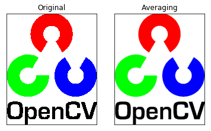
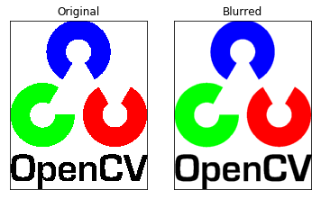
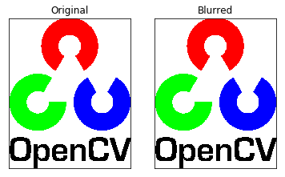
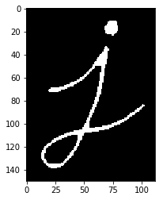
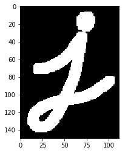

** {{ title }}：** <Excerpt in index | 首页摘要> 

粗略搬运，仅作个人笔记参考，有时间再美化，搬运自
* [OpenCV-Python] OpenCV 中的图像处理 部分 IV (一) - _Undo - 博客园  
https://www.cnblogs.com/Undo-self-blog/p/8434906.html 

颜色空间转化  
图像平滑  
形态学转换
<!-- more -->
<The rest of contents | 余下全文>

## 颜色空间转化
* cv2.cvtColor()
* cv2.inRange() 

cv2.cvtColor(input_image ，flag)，其中 flag就是转换类型。  
对于 BGR↔Gray 的转换，我们要使用的 flag 就是 cv2.COLOR_BGR2GRAY。  
同样对于 BGR↔HSV 的转换，我们用的 flag 就是 cv2.COLOR_BGR2HSV。  


## 几何变换
* cv2.warpAffine
* cv2.warpPerspective
* cv2.getPerspectiveTransform

### 扩展缩放
* cv2.resize()

### 平移
### 旋转
### 仿射变换
### 透视变换


```python
import cv2
import numpy as np
img=cv2.imread('./images/lena.jpg')
# 下面的 None 本应该是输出图像的尺寸，但是因为后边我们设置了缩放因子
# 因此这里为 None
res=cv2.resize(img,None,fx=2,fy=2,interpolation=cv2.INTER_CUBIC)
#OR
# 这里呢，我们直接设置输出图像的尺寸，所以不用设置缩放因子
height,width=img.shape[:2]
res=cv2.resize(img,(2*width,2*height),interpolation=cv2.INTER_CUBIC)
while(1):
    cv2.imshow('res',res)
    cv2.imshow('img',img)
    if cv2.waitKey(1) & 0xFF == 27:
        break
cv2.destroyAllWindows()
# Resize(src, dst, interpolation=CV_INTER_LINEAR)

```

## 图像平滑

### 2D卷积
OpenCV 提供的函数 cv.filter2D() 可以让我们对一幅图像进行卷积操作。下面我们将对一幅图像使用平均滤波器。下面是一个 5x5 的平均滤波器核：
$$K=\frac{1}{25}\left[\begin{array}{ccccc}{1} & {1} & {1} & {1} & {1} \\ {1} & {1} & {1} & {1} & {1} \\ {1} & {1} & {1} & {1} & {1} \\ {1} & {1} & {1} & {1} & {1} \\ {1} & {1} & {1} & {1} & {1}\end{array}\right]$$
操作如下：将核放在图像的一个像素 A 上，求与核对应的图像上 25（5x5）个像素的和，在取平均数，用这个平均数替代像素 A 的值。重复以上操作直到将图像的每一个像素值都更新一边。代码如下:  


```python
import cv2
import numpy as np
from matplotlib import pyplot as plt

img = cv2.imread('./images/opencv-logo.png')
img = cv2.cvtColor(img, cv2.COLOR_BGR2RGB)

kernel = np.ones((5,5),np.float32)/25
dst = cv2.filter2D(img, -1, kernel)

plt.subplot(121),plt.imshow(img),plt.title('Original')
plt.xticks([]), plt.yticks([])
plt.subplot(122),plt.imshow(dst),plt.title('Averaging')
plt.xticks([]), plt.yticks([])
plt.show()
```





### 图像模糊（图像平滑）
使用低通滤波器可以达到图像模糊的目的。这对与去除噪音很有帮助。其实就是去除图像中的高频成分（比如：噪音，边界）。所以边界也会被模糊一点。（当然，也有一些模糊技术不会模糊掉边界）。OpenCV 提供了四种模糊技术。  

### 平均
　　这是由一个归一化卷积框完成的。他只是用卷积框覆盖区域所有像素的平均值来代替中心元素。可以使用函数 cv2.blur() 和 cv2.boxFilter() 来完这个任务。可以同看查看文档了解更多卷积框的细节。我们需要设定卷积框的宽和高。下面是一个 3x3 的归一化卷积框：
　　　　　$$　K =  \frac{1}{9} \begin{bmatrix} 1 & 1 & 1  \\ 1 & 1 & 1 \\ 1 & 1 & 1 \end{bmatrix}$$
注意：如果你不想使用归一化卷积框，你应该使用 cv2.boxFilter()，这时要传入参数 normalize=False。
下面与第一部分一样的一个例子：


```python
import cv2
import numpy as np
from matplotlib import pyplot as plt

img = cv2.imread('./images/opencv-logo.png')

blur = cv2.blur(img,(5,5))

plt.subplot(121),plt.imshow(img),plt.title('Original')
plt.xticks([]), plt.yticks([])
plt.subplot(122),plt.imshow(blur),plt.title('Blurred')
plt.xticks([]), plt.yticks([])
plt.show()
```





### 高斯模糊
　　现在把卷积核换成高斯核（简单来说，方框不变，将原来每个方框的值是相等的，现在里面的值是符合高斯分布的，方框中心的值最大，其余方框根据距离中心元素的距离递减，构成一个高斯小山包。原来的求平均数现在变成求加权平均数，全就是方框里的值）。实现的函数是 cv2.GaussianBlur()。我们需要指定高斯核的宽和高（必须是奇数）。以及高斯函数沿 X，Y 方向的标准差。如果我们只指定了 X 方向的的标准差，Y 方向也会取相同值。如果两个标准差都是 0，那么函数会根据核函数的大小自己计算。高斯滤波可以有效的从图像中去除高斯噪音。
如果你愿意的话，你也可以使用函数 cv2.getGaussianKernel() 自己构建一个高斯核。
如果要使用高斯模糊的话，上边的代码应该写成：


```python
import cv2
import numpy as np
from matplotlib import pyplot as plt

img = cv2.imread('./images/opencv-logo.png')

#0 是指根据窗口大小（ 5,5 ）来计算高斯函数标准差
blur = cv2.GaussianBlur(img,(5,5),0)

plt.subplot(121),plt.imshow(img),plt.title('Original')
plt.xticks([]), plt.yticks([])
plt.subplot(122),plt.imshow(blur),plt.title('Blurred')
plt.xticks([]), plt.yticks([])
plt.show()
```


### 中值模糊
顾名思义就是用与卷积框对应像素的中值来替代中心像素的值。这个滤波器经常用来去除椒盐噪声。前面的滤波器都是用计算得到的一个新值来取代中心像素的值，而中值滤波是用中心像素周围（也可以使他本身）的值来取代他。他能有效的去除噪声。卷积核的大小也应该是一个奇数。
在这个例子中，我们给原始图像加上 50% 的噪声然后再使用中值模糊。


```python
import cv2
import numpy as np
from matplotlib import pyplot as plt

img = cv2.imread('./images/opencv-logo.png')

median = cv2.medianBlur(img,5)

plt.subplot(121),plt.imshow(img),plt.title('Original')
plt.xticks([]), plt.yticks([])
plt.subplot(122),plt.imshow(blur),plt.title('Blurred')
plt.xticks([]), plt.yticks([])
plt.show()
```


### 双边滤波

函数 cv2.bilateralFilter() 能在保持边界清晰的情况下有效的去除噪音。但是这种操作与其他滤波器相比会比较慢。我们已经知道高斯滤波器是求中心点邻近区域像素的高斯加权平均值。这种高斯滤波器只考虑像素之间的空间关系，而不会考虑像素值之间的关系（像素的相似度）。所以这种方法不会考虑一个像素是否位于边界。因此边界也会别模糊掉，而这正不是我们想要。双边滤波在同时使用空间高斯权重和灰度值相似性高斯权重。空间高斯函数确保只有邻近区域的像素对中心点有影响，灰度值相似性高斯函数确保只有与中心像素灰度值相近的才会被用来做模糊运算。所以这种方法会确保边界不会被模糊掉，因为边界处的灰度值变化比较大。


```python
import cv2
import numpy as np
from matplotlib import pyplot as plt

img = cv2.imread('./images/opencv-logo.png')
img = cv2.cvtColor(img, cv2.COLOR_BGR2RGB)

#cv2.bilateralFilter(src, d, sigmaColor, sigmaSpace)
#d – Diameter of each pixel neighborhood that is used during filtering.
# If it is non-positive, it is computed from sigmaSpace
#9 邻域直径，两个 75 分别是空间高斯函数标准差，灰度值相似性高斯函数标准差
blur = cv2.bilateralFilter(img,9,75,75)

plt.subplot(121),plt.imshow(img),plt.title('Original')
plt.xticks([]), plt.yticks([])
plt.subplot(122),plt.imshow(blur),plt.title('Blurred')
plt.xticks([]), plt.yticks([])
plt.show()
```





## 形态学转换
形态学操作是根据图像形状进行的简单操作。一般情况下对二值化图像进行的操作。需要输入两个参数，一个是原始图像，第二个被称为结构化元素或核，它是用来决定操作的性质的。两个基本的形态学操作是腐蚀和膨胀。他们的变体构成了开运算，闭运算，梯度等。


### 腐蚀

就像土壤侵蚀一样，这个操作会把前景物体的边界腐蚀掉（但是前景仍然是白色）。这是怎么做到的呢？卷积核沿着图像滑动，如果与卷积核对应的原图像的所有像素值都是 1，那么中心元素就保持原来的像素值，否则就变为零。  
这会产生什么影响呢？根据卷积核的大小靠近前景的所有像素都会被腐蚀掉（变为 0），所以前景物体会变小，整幅图像的白色区域会减少。这对于去除白噪声很有用，也可以用来断开两个连在一块的物体等。


```python
import cv2
import numpy as np
from matplotlib import pyplot as plt

img = cv2.imread('./images/j.png', 1)
kernel = np.ones((5,5),np.uint8)
erosion = cv2.erode(img,kernel,iterations = 1)

plt.imshow(erosion)
plt.show()
```





### 膨胀

与腐蚀相反，与卷积核对应的原图像的像素值中只要有一个是 1，中心元素的像素值就是 1。所以这个操作会增加图像中的白色区域（前景）。一般在去噪声时先用腐蚀再用膨胀。因为腐蚀在去掉白噪声的同时，也会使前景对象变小。所以我们再对他进行膨胀。这时噪声已经被去除了，不会再回来了，但是前景还在并会增加。膨胀也可以用来连接两个分开的物体。


```python
import cv2
import numpy as np
from matplotlib import pyplot as plt

img = cv2.imread('./images/j.png', 1)
kernel = np.ones((5,5),np.uint8)
dilation = cv2.dilate(img,kernel,iterations = 1)

plt.imshow(dilation)
plt.show()
```





### 开运算
先进性腐蚀再进行膨胀就叫做开运算。就像我们上面介绍的那样，它被用来去除噪声。这里我们用到的函数是 cv2.morphologyEx()。

### 闭运算
先膨胀再腐蚀。它经常被用来填充前景物体中的小洞，或者前景物体上的小黑点。

### 形态学梯度
其实就是一幅图像膨胀与腐蚀的差别。结果看上去就像前景物体的轮廓。


