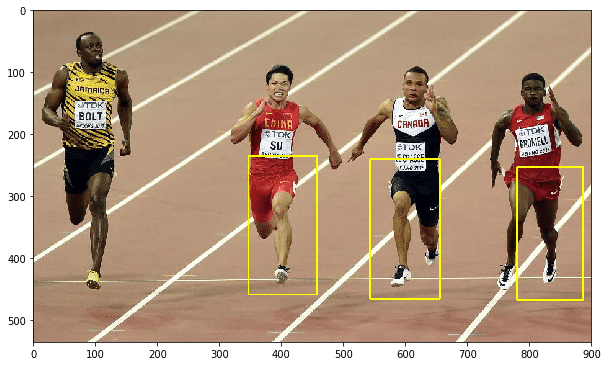

** {{ title }} ** <Excerpt in index | 首页摘要> 

### 目标检测和识别
传统目标检测算法中的技术：  
* 梯度直方图（Histogram of Oriented Gradient， HOG）  
* 图像金字塔（image pyramid）  
* 滑动窗口（sliding window）  

<!-- more -->
<The rest of contents | 余下全文>

与特征检测算法不同，这些算法是互补的。如在梯度直方图（HOG）中会使用滑动窗口技术。

### HOG
* Histogram of Oriented Gradients | Learn OpenCV  
https://www.learnopencv.com/histogram-of-oriented-gradients/  

HOG，全称方向梯度直方图，是一个特征描述符，它基于梯度来计算直方图。

步骤：  
1）图像预处理  
包括伽马矫正和灰度化，可选步骤。
为了减少光照因素的影响，首先需要将整个图像进行规范化（归一化）。在图像的纹理强度中，局部的表层曝光贡献的比重较大，所以，这种压缩处理能够有效地降低图像局部的阴影和光照变化；   
因为颜色信息作用不大，通常先转化为灰度图。 

2）计算每个像素点的梯度  
计算图像横坐标和纵坐标方向的梯度，并据此计算每个像素位置的梯度方向值；求导操作不仅能够捕获轮廓，人影和一些纹理信息，还能进一步弱化光照的影响。  
图像中像素点$(x,y)$的梯度为：  
$$G_x(x,y) = H(x+1,y) - H(x-1,y) $$
$$G_y(x,y) = H(x,y+1) - H(x,y-1) $$
其中$G_x(x,y)$,$G_y(x,y)$,$H(x,y)$分别表示图像中像素点$(x,y)$处的水平方向梯度、垂直方向梯度和像素值。像素点$(x,y)$处的梯度幅度和梯度方向分别为：  
$$G(x,y) = \sqrt{G_x(x,y)^2 + G_y(x,y)^2} $$
$$\alpha(x,y) = \tan^{-1}{(\frac{G_y(x,y)}{G_x(x,y)})} $$  
最常用的方法是：首先用[-1,0,1]梯度算子对原图像做卷积运算，得到x方向（水平方向，以向右为正方向）的梯度分量gradscalx，然后用[1,0,-1]T梯度算子对原图像做卷积运算，得到y方向（竖直方向，以向上为正方向）的梯度分量gradscaly，最后用以上公式计算该像素点的梯度大小和方向。  

3）计算梯度直方图  
梯度直方图是在一个8*8的cell里面计算的。那么在8*8的cell里面就会有8*8*2=128个值，其中2包括了梯度强度和梯度方向。通过统计形成梯度直方图，128个值将会变成9个值，大大降低了计算量，同时又对光照等环境变化更加地鲁棒。  

首先将0-180度分成9个bins，分别是0，20，40...160；然后根据梯度方向值的大小，将每一个像素点的梯度幅度值分配到相应的bin上；最终得到如下图所示的直方图，一个长度为9的数组。  

从上图可以看到，更多的点的梯度方向是倾向于0度和160度，也就是说这些点的梯度方向是向上或者向下，表明图像这个位置存在比较明显的横向边缘。因此HOG是对边角敏感的，由于这样的统计方法，也是对部分像素值变化不敏感的，所以能够适应不同的环境。   

bin值的具体计算方法如下例： 
  
先看两个蓝色圈圈。因为蓝圈的方向是80度，大小是2，所以该点就投给80这个bin；  
再看两个红色圈圈。因为红色圈圈的方向是10，大小是4，因为10距离0点为10，距离20点为也为10，那么有一半的大小是投给0这个bin，还有一半的大小投给20这个bin。  

4）块内归一化梯度直方图  
归一化的目的是降低光照的影响。  
归一化的方法是向量的每一个值除以向量的模长。  

5）收集HOG特征  
将检测窗口中所有重叠的块进行HOG特征的收集，并将它们结合成最终的特征向量供分类使用。  
一个图像的HOG特征维数计算:  
对于一个$64\times128$大小的图像，按照$16\times16$的大小提取block，将会有7个水平位置和15个竖直位可以取得，所以一共有$7\times15=105$个block，所以我们整合所有block的vector，形成一个大的一维vector的大小将会是$36\times105=3780$。

### OpenCV HOGDescriptor 

* 窗口大小 winSize(64,128)
* 块大小 blockSize(16,16)
* 块滑动增量 blockStride(8,8)
* 胞元大小 cellSize(8,8)
* 梯度方向数 nbins(9) 

在确定了上述的参数后，就可以计算出一个HOG描述子的维度了。


``` cpp
size_t HOGDescriptor::getDescriptorSize() const
{
    CV_Assert(blockSize.width % cellSize.width == 0 &&
        blockSize.height % cellSize.height == 0);
    CV_Assert((winSize.width - blockSize.width) % blockStride.width == 0 &&
        (winSize.height - blockSize.height) % blockStride.height == 0 );
    return (size_t)nbins*
        (blockSize.width/cellSize.width)*
        (blockSize.height/cellSize.height)*
        ((winSize.width - blockSize.width)/blockStride.width + 1)*
        ((winSize.height - blockSize.height)/blockStride.height + 1);
}
```


``` python
import cv2
import matplotlib.pyplot as plt

%matplotlib inline

plt.figure(figsize=(10,10))

# 确定某矩形是否完全包含在另一个矩形中
def is_inside(o, i):
    ox, oy, ow, oh = o
    ix, iy, iw, ih = i
    return ox > ix and oy > iy and ox+ow < ix+iw and oy + oh < iy + ih

# 绘制矩形来框住检测到的人
def draw_person(image, person):
    x, y, w, h = person
    cv2.rectangle(img, (x, y), (x+w, y + h), (0, 255, 255), 2)


# 导入图像，
img = cv2.imread("./images/run.jpg")
# 实例化HOGDescriptor对象，作为检测人的检测器
hog = cv2.HOGDescriptor()
# 设置线性SVM分类器的系数
hog.setSVMDetector(cv2.HOGDescriptor_getDefaultPeopleDetector())

# 该和人脸算法不一样，不需要在使用目标检测方法前将原始图像转换为灰度形式
# 该方法返回一个与矩形相关的数组，用户可用该数组在图形上绘制形状
# 若图形上的矩形存在有包含与被包含的关系，说明检测出现了错误
# 被包含的图形应该被丢弃，此过程由is_inside来实现
# 在输入图像中检测不同大小的对象。检测到的对象作为列表返回
found, w = hog.detectMultiScale(img)

found_filtered = []

# 遍历检测结果，丢弃不含有检测目标区域的矩形。
for ri, r in enumerate(found):
    for qi, q in enumerate(found):
        if ri != qi and is_inside(r, q):
            break
        else:
            found_filtered.append(r)

for person in found_filtered:
    draw_person(img, person)

# cv2.imshow("people detection", img)
# cv2.waitKey(0)
# cv2.destroyAllWindows()
plt.imshow(cv2.cvtColor(img, cv2.COLOR_BGR2RGB))
plt.show()
```




```python
import cv2
import numpy as np
import math
import matplotlib.pyplot as plt

%matplotlib inline
plt.figure(figsize=(10,10))

class Hog_descriptor():
    def __init__(self, img, cell_size=16, bin_size=9):
        self.img = img
        self.img = np.sqrt(img / np.max(img))
        self.img = img * 255
        self.cell_size = cell_size
        self.bin_size = bin_size
        self.angle_unit = int(360 / self.bin_size)
        assert type(self.bin_size) == int, "bin_size should be integer,"
        assert type(self.cell_size) == int, "cell_size should be integer,"
        assert type(self.angle_unit) == int, "bin_size should be divisible by 360"

    def extract(self):
        height, width = self.img.shape
        gradient_magnitude, gradient_angle = self.global_gradient()
        gradient_magnitude = abs(gradient_magnitude)
        cell_gradient_vector = np.zeros((int(height / self.cell_size), int(width / self.cell_size), self.bin_size))
        for i in range(cell_gradient_vector.shape[0]):
            for j in range(cell_gradient_vector.shape[1]):
                cell_magnitude = gradient_magnitude[i * self.cell_size:(i + 1) * self.cell_size,
                                 j * self.cell_size:(j + 1) * self.cell_size]
                cell_angle = gradient_angle[i * self.cell_size:(i + 1) * self.cell_size,
                             j * self.cell_size:(j + 1) * self.cell_size]
                cell_gradient_vector[i][j] = self.cell_gradient(cell_magnitude, cell_angle)

        hog_image = self.render_gradient(np.zeros([height, width]), cell_gradient_vector)
        hog_vector = []
        for i in range(cell_gradient_vector.shape[0] - 1):
            for j in range(cell_gradient_vector.shape[1] - 1):
                block_vector = []
                block_vector.extend(cell_gradient_vector[i][j])
                block_vector.extend(cell_gradient_vector[i][j + 1])
                block_vector.extend(cell_gradient_vector[i + 1][j])
                block_vector.extend(cell_gradient_vector[i + 1][j + 1])
                mag = lambda vector: math.sqrt(sum(i ** 2 for i in vector))
                magnitude = mag(block_vector)
                if magnitude != 0:
                    normalize = lambda block_vector, magnitude: [element / magnitude for element in block_vector]
                    block_vector = normalize(block_vector, magnitude)
                hog_vector.append(block_vector)
        return hog_vector, hog_image

    def global_gradient(self):
        gradient_values_x = cv2.Sobel(self.img, cv2.CV_64F, 1, 0, ksize=5)
        gradient_values_y = cv2.Sobel(self.img, cv2.CV_64F, 0, 1, ksize=5)
        gradient_magnitude = cv2.addWeighted(gradient_values_x, 0.5, gradient_values_y, 0.5, 0)
        gradient_angle = cv2.phase(gradient_values_x, gradient_values_y, angleInDegrees=True)
        return gradient_magnitude, gradient_angle

    def cell_gradient(self, cell_magnitude, cell_angle):
        orientation_centers = [0] * self.bin_size
        for i in range(cell_magnitude.shape[0]):
            for j in range(cell_magnitude.shape[1]):
                gradient_strength = cell_magnitude[i][j]
                gradient_angle = cell_angle[i][j]
                min_angle, max_angle, mod = self.get_closest_bins(gradient_angle)
                orientation_centers[min_angle] += (gradient_strength * (1 - (mod / self.angle_unit)))
                orientation_centers[max_angle] += (gradient_strength * (mod / self.angle_unit))
        return orientation_centers

    def get_closest_bins(self, gradient_angle):
        idx = int(gradient_angle / self.angle_unit)
        mod = gradient_angle % self.angle_unit
        return idx, (idx + 1) % self.bin_size, mod

    def render_gradient(self, image, cell_gradient):
        cell_width = self.cell_size / 2
        max_mag = np.array(cell_gradient).max()
        for x in range(cell_gradient.shape[0]):
            for y in range(cell_gradient.shape[1]):
                cell_grad = cell_gradient[x][y]
                cell_grad /= max_mag
                angle = 0
                angle_gap = self.angle_unit
                for magnitude in cell_grad:
                    angle_radian = math.radians(angle)
                    x1 = int(x * self.cell_size + magnitude * cell_width * math.cos(angle_radian))
                    y1 = int(y * self.cell_size + magnitude * cell_width * math.sin(angle_radian))
                    x2 = int(x * self.cell_size - magnitude * cell_width * math.cos(angle_radian))
                    y2 = int(y * self.cell_size - magnitude * cell_width * math.sin(angle_radian))
                    cv2.line(image, (y1, x1), (y2, x2), int(255 * math.sqrt(magnitude)))
                    angle += angle_gap
        return image

img = cv2.imread('./images/car.jpg', cv2.IMREAD_GRAYSCALE)
# img = cv2.resize(img, (128, 64))
hog = Hog_descriptor(img, cell_size=8, bin_size=9)
vector, image = hog.extract()
print(np.array(vector).shape)
plt.imshow(image, cmap=plt.cm.gray)
plt.show()
```


### 图像金字塔
图像金字塔是图像的多尺度表示。  

构建图像金字塔：  
1 - 获取图像  
2 - 使用任意尺度的参数来调整（缩小）图像大小  
3 - 平滑图像（使用高斯模糊）  
4 - 如果图像比最小尺寸还大，则从第一步重复该过程。  

### 滑动窗口

滑动窗口通过扫描较大图像的较小区域来解决定位问题，进而在同一图像的不同尺度下重复扫描。  

该技术需将图像分解成多个部分，然后丢掉那些不太可能包含对象的部分，并对可能区域进行分类。  

### 非极大抑制

非极大值抑制（Non-maximum suppression, NMS）释义为抑制不是极大值的元素，搜索局部的极大值。  

如在对象检测中，滑动窗口经提取特征 --> 分类器分类识别后，每个窗口都会得到一个分类和分数，但滑动窗口会导致很多窗口与其他窗口存在包含或大部分交叉的情况，这时就需要用到 NMS 来选取那些邻域里分数最高（某类对象的概率最大），并抑制这些分数低的窗口。 

也可理解为：目标检测的过程中，同一目标位置上会产生大量的候选框，这些候选框相互之间可能会有重叠，此时我们需要利用非极大值抑制找到最佳的目标边界框，消除冗余的边界框。  

### 使用HOG+SVM做行人检测

参考2005年CVPR论文，使用HOG+SVM做行人检测
论文链接：  
* Histograms of Oriented Gradients for Human Detection   
https://hal.inria.fr/file/index/docid/548512/filename/hog_cvpr2005.pdf

工作流程：首先对输入的图片进行预处理，然后计算像素点的梯度值，然后形成梯度直方图，然后对blocks进行normalize，最后收集到HOG feature（其实是一行高维的vector）放到SVM里进行监督学习，从而实现行人的检测。  


### INRIA数据集

INRIA数据集官方页面：  
* http://pascal.inrialpes.fr/data/human/

整理版本：  
* INRIA数据集 - baiyu33的博客 - CSDN博客   
https://blog.csdn.net/baiyu33/article/details/51762368

### HardExample

用分类器对样本进行分类，把其中错误分类的样本(hard negative)放入负样本集合再继续训练分类器。  

难例(或叫做难样本，Hard Example，Hard Negative，Hard Instance)是指利用第一次训练的分类器在负样本原图(肯定没有人体)上进行行人检测时所有检测到的矩形框，这些矩形框区域很明显都是误报，把这些误报的矩形框保存为图片，加入到初始的负样本集合中，重新进行SVM的训练，可显著减少误报。这种方法叫做自举法(Bootstrap)，自举法首先使用初始负样本集来训练一个模型，然后收集被这个初始模型错误分类的负样本来形成一个负样本难例集。用此负样本难例集训练新的模型，此过程可以重复多次。


### OHEM
在线难例挖掘（online hard example miniing）  
选取loss较大(检测结果与label差异较大)的部分进行训练。  


### 基于深度学习的方法

* RCNN 
* Fast-RCNN
* YOLO
* SSD


### 参考资料
* OpenCV 学习笔记 07 目标检测与识别 - 耕毅 - 博客园  
https://www.cnblogs.com/gengyi/p/10555622.html
