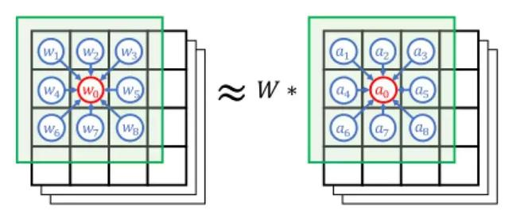
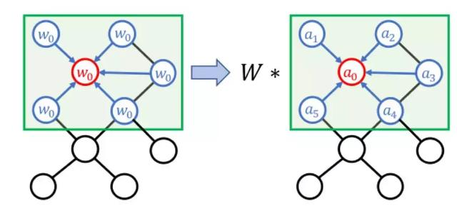
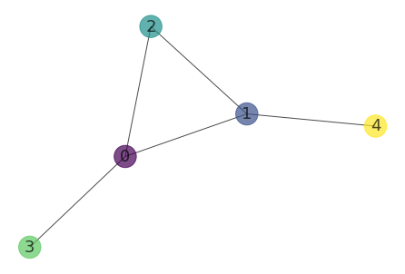
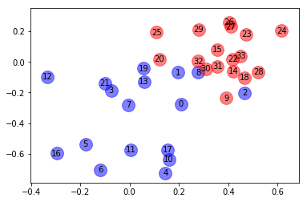
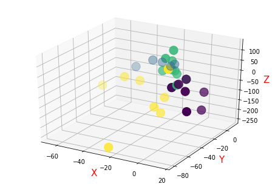
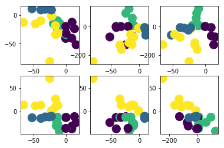
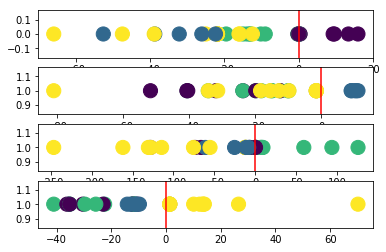

** {{ title }} ** <Excerpt in index | 首页摘要>
做个跳跳灯！

* 解读：基于动态骨骼的动作识别方法ST-GCN（时空图卷积网络模型） - 浪浪的博客 - CSDN博客  
https://blog.csdn.net/qq_36893052/article/details/79860328

<!-- more -->
<The rest of contents | 余下全文>

<html>
<head>
<meta charset="utf-8"> 
<title>菜鸟教程(runoob.com)</title> 
<script src="https://cdn.staticfile.org/jquery/1.10.2/jquery.min.js">
</script>
<script>
$(document).ready(function(){
    $(document).on('click', '.fold_hider', function(){
        $('>.fold', this.parentNode).slideToggle();
        $('>:first', this).toggleClass('open');
    });
    $("div.fold").css("display","none");
});
</script>
</head>
</html>


### Ubuntu16.04下环境配置

安装图神经网络库DGL
* Overview of DGL — DGL 0.3 documentation  
https://docs.dgl.ai/index.html
``` bash
pip install dgl
```

* http://download.pytorch.org/whl/cpu/torch-0.3.1-cp35-cp35m-linux_x86_64.whl 

安装pytorch，直接下载.whl文件，在本地进行安装
``` bash
pip install torch-0.3.1-cp35-cp35m-linux_x86_64.whl
pip install torchvision

cd Workplace/
jupyter notebook --ip=0.0.0.0 --no-browser --allow-root
```


## GCN


GCN 是一种可直接作用于图并利用其结构信息的神经网络。

给定图 $G = (V, E)$ ，GCN 的输入为：

- 1. 一个输入维度为 $N × F^0$ 的特征矩阵 $X$，其中 $N$ 是图网络中的节点数而 $F^0$ 是每个节点的输入特征数。
- 2. 一个图结构的维度为 $N × N$ 的矩阵表征，例如图 $G$ 的邻接矩阵 $A$ 。 

因此，GCN 中的隐藏层可以写作 $$H = f(H^{-1}, A))$$
其中，$H⁰ = X$ ，$f$ 是一种传播规则。  
每一个隐藏层 $H$ⁱ 都对应一个维度为 $N×Fⁱ$ 的特征矩阵，该矩阵中的每一行都是某个节点的特征表征。  
在每一层中，GCN 会使用传播规则 $f$ 将这些信息聚合起来，从而形成下一层的特征。这样一来，在每个连续的层中特征就会变得越来越抽象。  
在该框架下，GCN 的各种变体只不过是在传播规则 $f$ 的选择上有所不同。  


图卷积操作就是传统的卷积操作在拓扑图上的概念延伸和转移。
<center>
    
    
</center>

GCN的本质就是提取图的结构特征，关键在于如何定义局部接受域(receptive field)，主要有两种方式：
- Spatial approach 基于空域的图卷积  
 如何定义局部感受域或者是邻居和节点的顺序 比如给节点的边指定方向
- Spectral approach 基于谱域的图卷积  
 通过图的拉普拉斯矩阵的特征值和特征向量对图结构进行处理。


### 示例
$$
f(H^l, A)=D^{-1} \hat{A} H^l W
$$

* GCN学习笔记：第一部分，手把手用Numpy实现GCN - weixin_42052081的博客 - CSDN博客  
https://blog.csdn.net/weixin_42052081/article/details/89108966
* 浅谈GCN - 宁静致远 - CSDN博客  
https://blog.csdn.net/weiyudang11/article/details/92662420

* NetworkX系列教程(1)-创建graph - ７秒记忆的战斗机 - 博客园  
https://www.cnblogs.com/wushaogui/p/9199726.html


NetworkX提供了4种常见网络的建模方法:
- 规则图  
  规则图差不多是最没有复杂性的一类图，random_graphs.random_regular_graph(d, n)方法可以生成一个含有n个节点，每个节点有d个邻居节点的规则图。
 ``` python
 # generate a regular graph which has 20 nodes & each node has 3 neghbour nodes.
 RG = nx.random_graphs.random_regular_graph(3, 20)
 ```
- ER随机图  
  ER随机图是早期研究得比较多的一类“复杂”网络，模型的基本思想是以概率p连接N个节点中的每一对节点。用random_graphs.erdos_renyi_graph(n,p)方法生成一个含有n个节点、以概率p连接的ER随机图。
 ``` python
 # generate a graph which has n=20 nodes, probablity p = 0.2.
 ER = nx.random_graphs.erdos_renyi_graph(20, 0.2)
 ```
- WS小世界网络  
  用random_graphs.watts_strogatz_graph(n, k, p)方法生成一个含有n个节点、每个节点有k个邻居、以概率p随机化重连边的WS小世界网络。
 ``` python
 # random reconnection probability was 0.3.
 WS = nx.random_graphs.watts_strogatz_graph(20, 4, 0.3)
 ```
- BA无标度网络  
  用random_graphs.barabasi_albert_graph(n, m)方法生成一个含有n个节点、每次加入m条边的BA无标度网络。
 ``` python 
 # generalize BA network which has 20 nodes, m = 1
 BA = nx.random_graphs.barabasi_albert_graph(20, 1)
 ```

生成有5个节点的小世界网络，A是图的邻接矩阵。


```python
import networkx as nx

n = 5
colors = list(range(n))

g=nx.random_graphs.watts_strogatz_graph(5, 3, 0.3)
# g = nx.random_graphs.barabasi_albert_graph(5, 2)

nx.draw_kamada_kawai(g, with_labels=True, node_color=colors, alpha=0.7, node_size=600, font_size =18)
A = nx.adjacency_matrix(g).todense()
A
```





X是节点的信息。  
现实中每个node都有自己的特征，这里生成一个简单的$feature = [i, -i] $


```python
import numpy as np
X = np.matrix([
            [i, -i]
            for i in range(A.shape[0])
        ], dtype=float)
X
```


$AX$只是对邻接域节点进行求和。
- 简单的sum对特征提取具有关于节点度的倾向性即节点度越大，聚合的信息就越大。
- $A$中不存在self-loop，提取的信息不包含节点本身的信息。


```python
A*X
```


问题一：节点的聚合表征不包含它自己的特征，该表征是相邻节点的特征聚合，因此只有具有自环（self-loop）的节点才会在该聚合中包含自己的特征。

增加自环可以解决这一个问题，通过在应用传播规则之前将邻接矩阵$A$与单位矩阵$I$相加来实现。


```python
A_hat = A + np.eye(A.shape[0])
print("A_hat:\n", A_hat)
print("A_hat * X:\n", A_hat * X)
```


问题二：度大的节点在其特征表征中将具有较大的值，度小的节点将具有较小的值，这可能会导致梯度消失或梯度爆炸。

对特征表征进行归一化处理，通过将邻接矩阵 $A$ 与度矩阵 $D$ 的逆相乘，对其进行变换，从而通过节点的度对特征表征进行归一化。  
定义$D=\Sigma_{\jmath} A_{i j}$为节点度的对角矩阵。


```python
D = np.array(np.sum(A, axis=0))[0]
D = np.matrix(np.diag(D))
print("D:")
print(D)

D_hat = np.array(np.sum(A_hat, axis=0))[0]
D_hat = np.matrix(np.diag(D_hat))
print("D_hat:")
print(D_hat)
```

```python
D**-1 * A
```


```python
D**-1 * A * X
```


```python
D_hat**-1 * A_hat * X
```


添加权重


```python
W = np.matrix([
             [1, -1],
             [-1, 1]
         ])
D_hat**-1 * A_hat * X * W
```


添加激活函数


```python
def relu(x):
    return (abs(x) + x) / 2
```

```python
relu(D_hat**-1 * A_hat * X * W)
```

<body>
<div>
    <div class="fold_hider">
        <div class="close hider_title">点击显示/隐藏代码</div>
    </div>
    <div class="fold">

```python
import networkx as nx
from networkx import to_numpy_matrix

g = nx.karate_club_graph()
A = to_numpy_matrix(g, nodelist = g.nodes())

A_hat = A + np.eye(A.shape[0])
D_hat = np.array(np.sum(A_hat, axis=0))[0]
D_hat = np.matrix(np.diag(D_hat))

I = np.eye(A.shape[0])

```


```python
def gcn_layer(A_hat, D_hat, X, W):
#     return relu(D_hat**-1 * A_hat * X * W)
    return (D_hat**-1 * A_hat * X * W)
```


```python
W_1 = np.random.normal(
    loc=0, scale=1, size=(g.number_of_nodes(), 4))
W_2 = np.random.normal(
    loc=0, size=(W_1.shape[1], 2))
```


```python
H_1 = gcn_layer(A_hat, D_hat, I, W_1)
H_2 = gcn_layer(A_hat, D_hat, H_1, W_2)
output = H_2
output
```


```python
import matplotlib.pyplot as plt


for i in range (34):
    if g.nodes[i]['club'] == 'Mr. Hi':
        plt.scatter(np.array(output)[i,0],np.array(output)[i,1] ,label=str(i),color = 'b',alpha=0.5,s = 250)
        plt.text(np.array(output)[i,0],np.array(output)[i,1] ,i, horizontalalignment='center',verticalalignment='center', fontdict={'color':'black'})
        # 为每个点添加标签，一些形如（x轴，y轴，标签）的元组，水平及垂直位置，背景颜色
    else:
        plt.scatter(np.array(output)[i,0],np.array(output)[i,1] ,label = 'i',color = 'r',alpha=0.5,s = 250)
        plt.text(np.array(output)[i,0],np.array(output)[i,1] ,i, horizontalalignment='center',verticalalignment='center', fontdict={'color':'black'})
        # plt.scatter(np.array(output)[:,0],np.array(output)[:,1],label = 0:33)

```
</div>
</div>
</body>





这样的特征表征可以很好地将 Zachary 空手道俱乐部的两个社区划分开来。至此，我们甚至都没有开始训练模型。


<body>
<div>
    <div class="fold_hider">
        <div class="close hider_title">点击显示/隐藏代码</div>
    </div>
    <div class="fold">
        ``` python
        from networkx import karate_club_graph,to_numpy_matrix
        import numpy as np
        import tensorflow as tf
        import matplotlib.pyplot as plt

        # step1: Data preparation
        zkc = karate_club_graph()
        order = sorted(list(zkc.nodes()))

        NODE_SIZE = len(order)
        #Adjacency matrix
        A = to_numpy_matrix(zkc, nodelist=order)

        #identity matrix
        I = np.eye(zkc.number_of_nodes())

        node_label = []
        for i in range(34):
            label = zkc.node[i]
        #     node_label.append(np.random.randint(10)%4)
            if label['club'] == 'Officer':
                if np.random.randint(10)%2 == 0:
                    node_label.append(1)       
                else:
                    node_label.append(3)
            else:
                if np.random.randint(10)%2 == 0:
                    node_label.append(2)       
                else:
                    node_label.append(0)
        


        # step2:  Parameter Settings             
        NODE_SIZE = 34
        NODE_FEATURE_DIM = 34
        HIDDEN_DIM1 = 10
        num_classes = 4
        training_epochs = 10000
        step = 10
        lr=0.1
        
        # step3: network define
        X = tf.placeholder(tf.float32, shape=[NODE_SIZE, NODE_FEATURE_DIM])
        Y = tf.placeholder(tf.int32, shape=[NODE_SIZE])
        label = tf.one_hot(Y, num_classes)

        adj = tf.placeholder(tf.float32, shape=[NODE_SIZE, NODE_SIZE])
        weights = {"hidden1": tf.Variable(tf.random_normal(dtype=tf.float32, shape=[NODE_FEATURE_DIM, HIDDEN_DIM1]), name='w1'),
                "hidden2": tf.Variable(tf.random_normal(dtype=tf.float32, shape=[HIDDEN_DIM1, num_classes]), name='w2')}
        D_hat = tf.matrix_inverse(tf.matrix_diag(tf.reduce_sum(adj, axis=0)))

        # GCN layer1
        l1 = tf.matmul(tf.matmul(tf.matmul(D_hat, adj), X), weights['hidden1'])
        # GCN layer2
        output = tf.matmul(tf.matmul(tf.matmul(D_hat, adj), l1), weights['hidden2'])


        # step4:define loss func and train
        loss = tf.reduce_sum(tf.nn.sigmoid_cross_entropy_with_logits(labels=label, logits=output))
        train_op = tf.train.AdamOptimizer(learning_rate=lr).minimize(loss)
        init_op = tf.global_variables_initializer()
        feed_dict = {adj: A, X: I, Y: node_label}


        from mpl_toolkits.mplot3d import Axes3D  # 空间三维画图

        plt.ion()
        # 绘制散点图
        fig = plt.figure()
        ax = Axes3D(fig)


        with tf.Session() as sess:
            sess.run(init_op)

            for epoch in range(training_epochs):
                c, _ = sess.run([loss, train_op], feed_dict)
                if epoch % 1000 == 0:
                    print(f'Epoch:{epoch} Loss {c}')


            represent = sess.run(output, feed_dict)
            print(represent)
            ax.scatter(represent[:, 0], represent[:, 1], represent[:, 2], s=200, c=node_label)
            
            # 添加坐标轴(顺序是Z, Y, X)
            ax.set_zlabel('Z', fontdict={'size': 15, 'color': 'red'})
            ax.set_ylabel('Y', fontdict={'size': 15, 'color': 'red'})
            ax.set_xlabel('X', fontdict={'size': 15, 'color': 'red'})
            plt.show()
            
            plt.scatter(represent[:, 0], represent[:, 1], s=200, c=node_label)
            plt.pause(0.1)
            plt.cla()
            
            plt.scatter(represent[:, 1], represent[:, 2], s=200, c=node_label)
            plt.pause(0.1)
            plt.cla()  

            plt.scatter(represent[:, 0], represent[:, 2], s=200, c=node_label)
            plt.pause(0.1)
            plt.cla()
            
            plt.scatter(represent[:, 0], represent[:, 3], s=200, c=node_label)
            plt.pause(0.1)
            plt.cla()
            
            plt.scatter(represent[:, 1], represent[:, 3], s=200, c=node_label)
            plt.pause(0.1)
            plt.cla()  

            plt.scatter(represent[:, 2], represent[:, 3], s=200, c=node_label)
            plt.pause(0.1)
            plt.cla()   
        ```
</div>
</div>
</body>







```python
ax.scatter(represent[:, 0], represent[:, 1], represent[:, 2], s=200, c=node_label)
    
# 添加坐标轴(顺序是Z, Y, X)
ax.set_zlabel('Z', fontdict={'size': 15, 'color': 'red'})
ax.set_ylabel('Y', fontdict={'size': 15, 'color': 'red'})
ax.set_xlabel('X', fontdict={'size': 15, 'color': 'red'})


plt.subplot(4, 1, 1)
plt.scatter(represent[:, 0], [0]*34, s=200, c=node_label)
plt.axvline(x=0, c='r')

plt.subplot(4, 1, 2)
plt.scatter(represent[:, 1], [1]*34, s=200, c=node_label)
plt.axvline(x=0, c='r')

plt.subplot(4, 1, 3)
plt.scatter(represent[:, 2], [1]*34, s=200, c=node_label)
plt.axvline(x=0, c='r')

plt.subplot(4, 1, 4)
plt.scatter(represent[:, 3], [1]*34, s=200, c=node_label)
plt.axvline(x=0, c='r')

plt.show()
```





