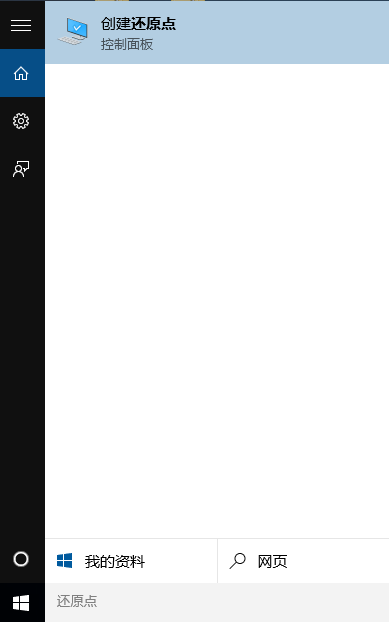
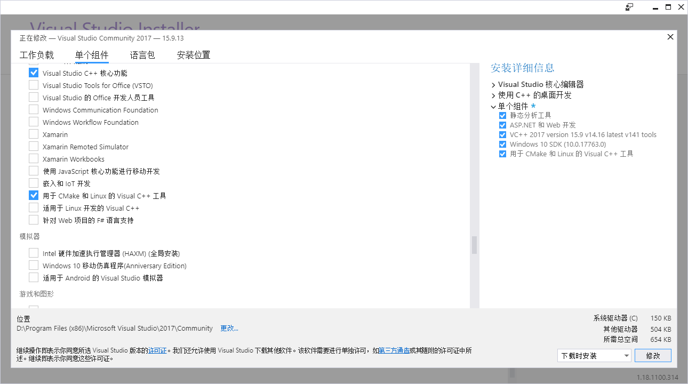
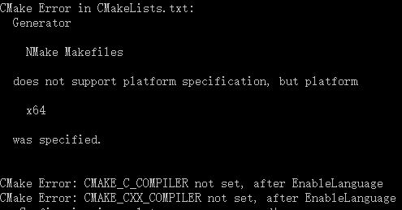

** {{ title }} ** <Excerpt in index | 首页摘要>

最近使用了dlib识别人脸68个特征点，教研室的win7很早之前就装的dlib当时没遇到什么坑，回家里在win10上安装“大礼包”竟然把电脑弄蓝屏了，在此记录一下。  

<div align=center>

</div>

搜索还原点->点击“配置”启用保护->创建还原点。  

<!-- more -->
<The rest of contents | 余下全文>


## 步骤
* 安装python
* 安装VS2017
* 安装cmake
* 安装dlib

## 安装python
安装Anaconda环境，顺便安装VScode  
* Home - Anaconda  
https://www.anaconda.com/

## 安装VS2017
安装Visual Studio2017，社区版  
* 下载 | IDE、Code 和 Team Foundation Server | Visual Studio  
https://visualstudio.microsoft.com/zh-hans/downloads/

注意勾选“Visual C++ tool for Cmake and linux”  
<div align=center>

</div>
否则会出现下面的问题    
<div>

</div>

## 安装cmake
``` bash
pip install cmake
```

## 安装dlib
方法一：直接使用pip
``` bash
pip install dlib
```

方法二：下载dlib源代码，编译、安装
* dlib C++ Library  
http://dlib.net/
``` bash
python setup.py install
```


