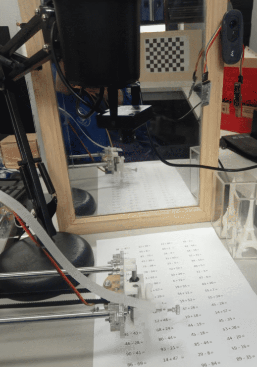

# 100以内加减法（小学二年级）算数机器人

## 当前的功能
拍一张答题纸，画四个点，透射变换为标准尺寸后进行算式分割，对每张算式图片检测识别数字后进行计算，并打印结果;  
手指指到相应算式下方，语音播报该计算结果。

## 待解决的问题
* 阴影下识别出错

## 接下来的工作
* 写字机器人接入?
* 更复杂的算式？

## Demo

<iframe height=498 width=510 src="http://player.youku.com/embed/XNDIyNzA4NDM0MA==">
</iframe>

* 算数-其他-高清完整正版视频在线观看-优酷 https://v.youku.com/v_show/id_XNDIyNzA4NDM0MA==.html

