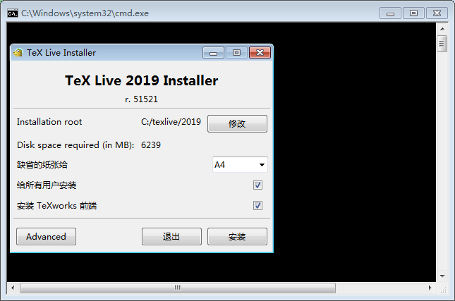
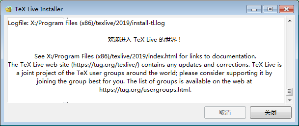

** {{ title }} ** <Excerpt in index | 首页摘要>


<!-- more -->
<The rest of contents | 余下全文>

## 安装 texlive

* TeX Live - TeX Users Group  
http://tug.org/texlive/

* LaTeX学习：Texlive 2019和TeX studio的安装及使用 - Mikchy的博客 - CSDN博客  
https://blog.csdn.net/mikchy/article/details/94448707



安装时间很长，得一个多小时。



## VScode安装插件

在扩展商店安装两个插件
> * LaTeX Workshop 
> * LaTeX language support

配置VScode的Latex插件，将下面代码放入VScode的setting.json配置文件中。

``` json   
    "editor.wordWrap": "on",
    "workbench.startupEditor": "newUntitledFile",
    "latex-workshop.latex.clean.enabled": true,
    "latex-workshop.latex.clean.fileTypes": [
        "*.aux",
        "*.bbl",
        "*.blg",
        "*.idx",
        "*.ind",
        "*.lof",
        "*.lot",
        "*.out",
        "*.toc",
        "*.acn",
        "*.acr",
        "*.alg",
        "*.glg",
        "*.glo",
        "*.gls",
        "*.ist",
        "*.fls",
        "*.log",
        "*.fdb_latexmk",
        "*.gz"
    ],
    "latex-workshop.view.pdf.viewer": "tab",
    "latex-workshop.latex.recipes": [
    {
            "name": "xelatex",
            "tools": [
              "xelatex",
              "xelatex"
            ]
          },
        {
            "name": "xelatexb",
            "tools": [
              "xelatex",
              "bibtex",
              "xelatex",
              "xelatex"
            ]
          },
        {
          "name": "latexmk",
          "tools": [
            "latexmk"
          ]
        },
        {
          "name": "pdflatex -> bibtex -> pdflatex*2",
          "tools": [
            "pdflatex",
            "bibtex",
            "pdflatex",
            "pdflatex"
          ]
        }
      ],
      "latex-workshop.latex.tools": [
        {
            "name": "xelatex",
            "command": "xelatex",
            "args": [
                "-synctex=1",
                "-interaction=nonstopmode",
                "-file-line-error",
                "%DOC%"
            ]
        },
        {
          "name": "latexmk",
          "command": "latexmk",
          "args": [
            "-synctex=1",
            "-interaction=nonstopmode",
            "-file-line-error",
            "-pdf",
            "%DOC%"
          ]
        },
        {
          "name": "pdflatex",
          "command": "pdflatex",
          "args": [
            "-synctex=1",
            "-interaction=nonstopmode",
            "-file-line-error",
            "%DOC%"
          ]
        },
        {
          "name": "bibtex",
          "command": "bibtex",
          "args": [
            "%DOCFILE%"
          ]
        }
      ],
      "latex-workshop.latex.autoClean.run": "onBuilt",
```


### 编译时提示缺少字体 kpathsea:make_tex: Invalid filename `Adobe Song Std/OT', contains ' '

xeltex默认编译时需要使用到四种adobe的中文字体，系统没有自带，需要手动安装

* /Resources/Fonts - 版本库 - Nd World - CS Projects  
https://cs.fit.edu/code/projects/ndworld/repository/revisions/12/show/Resources/Fonts

* 黑体(AdobeHeitiStd-Regular)
* 宋体(AdobeSongStd-Light)
* 仿宋(AdobeFangsongStd-Regular)
* 楷体(AdobeKaitiStd-Regular)

目录
* C:\Windows\Fonts
 