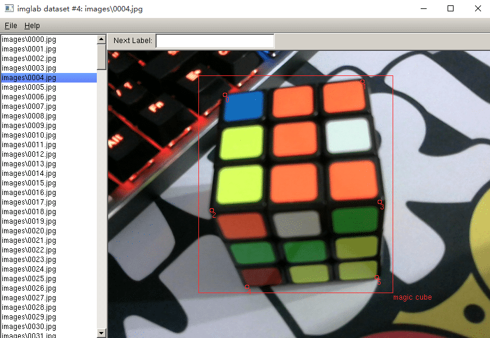

** {{ title }}：** <Excerpt in index | 首页摘要>

在使用dlib进行人脸识别和关键点检测的demo中，官方提供了训练好的数据：正脸检测器dlib.get_frontal_face_detector()
和特征点的训练库shape_predictor_68_face_landmarks.dat，如果想对自己的图形进行识别和关键点检测，可以使用dlib自带的imglab数据库标准工具制作训练集，再通过dlib的官方代码训练出模型，最后对模型进行测试。

* dlib train_object_detector  
http://dlib.net/train_object_detector.py.html

* dlib train_shape_predictor  
http://dlib.net/train_shape_predictor.py.html

<!-- more -->
<The rest of contents | 余下全文>

## 使用dlib的imglab工具标注数据集
下载官方源码  
* dlib C++ Library  
http://dlib.net/

在下载好的dlib官方文件.\tools\imglab目录下，新建文件夹build并进入  
``` bash
.\dlib-19.17\tools\imglab> mkdir build
>cd build
```
cmake
``` bash
.\dlib-19.17\tools\imglab\build> cmake ..
> cmake --build . --config Release 
```

在images文件夹下放入需要标注的图像，生成mydataset.xml文件  
``` bash
.\dlib-19.17\tools\imglab\build> Release\imglab.exe -c mydataset.xml images
```
打开imglab标注软件，进行标注
``` bash
> imglab mydataset.xml
```
<div align=center>

</div>

## imglab工具使用
| 功能 | 操作 |
| :-----| :--- | 
| 标注物体 | 在Next Label输入标记值，shift+左键画框 |
| 特征点标注 | 先选中长方形的框，再shift+左键依次标记 |
|  上/下一张图片| 键盘的up和down     |
| 放大或者缩小 |ctrl+滚动轴                  |
| 删除标记框 |  选中框 + delete |                    
## 标注好后的mydataset.xml文件
``` xml
<?xml version='1.0' encoding='ISO-8859-1'?>
<?xml-stylesheet type='text/xsl' href='image_metadata_stylesheet.xsl'?>
<dataset>
<name>imglab dataset</name>
<comment>Created by imglab tool.</comment>
<images>
  <image file='.\data\0000.jpg'>
    <box top='47' left='196' width='261' height='302'>
      <label>magic cube</label>
      <part name='0' x='207' y='63'/>
      <part name='1' x='415' y='58'/>
      <part name='2' x='207' y='245'/>
      <part name='3' x='443' y='238'/>
      <part name='4' x='224' y='339'/>
      <part name='5' x='409' y='333'/>
    </box>
  </image>
  ...
</images>
</dataset> 
```

## 训练

使用dlib提供的官方代码train_object_detector.py训练检测器模型，得到detector.svm模型文件，该检测原理基于滑窗、HOG和SVM  

* dlib train_object_detector  
http://dlib.net/train_object_detector.py.html

``` python
options = dlib.simple_object_detector_training_options()
# 左右对称
options.add_left_right_image_flips = True
# SVM γ
options.C = 5

options.num_threads = 4
options.be_verbose = True

training_xml_path = os.path.join(faces_folder, "mydataset.xml")
dlib.train_simple_object_detector(training_xml_path, "detector.svm", options)

```


使用dlib提供的官方代码train_shape_predictor.py训练关键点检测模型，得到predictor.dat模型文件

* dlib train_shape_predictor  
http://dlib.net/train_shape_predictor.py.html

算法基于《One Millisecond Face Alignment with an Ensemble of Regression Trees》这篇论文实现的，以gbdt为基础  
* GBDT的那些事儿 - 知乎  
https://zhuanlan.zhihu.com/p/30711812

``` bash
options = dlib.shape_predictor_training_options()
# 对训练样本随机变形扩大样本的倍数，通常大一点会好
options.oversampling_amount = 300
# 正则项
options.nu = 0.05
# 树的深度
options.tree_depth = 2
options.be_verbose = True

training_xml_path = os.path.join(faces_folder, "mydataset.xml")
dlib.train_shape_predictor(training_xml_path, "predictor.dat", options)
```

## 测试

```python
import numpy as np
import cv2
import dlib

detector = dlib.simple_object_detector("detector.svm")
predictor = dlib.shape_predictor('predictor.dat')

cap = cv2.VideoCapture(0)
ret, img = cap.read()

while ret:
    ret, img = cap.read()
    # 灰度
    img_gray = cv2.cvtColor(img, cv2.COLOR_RGB2GRAY)
    # 识别结果rects
    rects = detector(img_gray, 0)
    for (i,rect) in enumerate(rects):
        x1, y1, x2, y2, w, h = rect.left(), rect.top(), rect.right() + \
            1, rect.bottom() + 1, rect.width(), rect.height()
        cv2.rectangle(img, (x1, y1), (x1 + w, y1 + h), (205, 92, 92), 2)
        cv2.putText(img, "magic cube", (x1 - 20, y1 - 20), cv2.FONT_HERSHEY_TRIPLEX, 0.6, (205, 92, 92), 2)

        landmarks = np.matrix([[p.x, p.y] for p in predictor(img,rects[i]).parts()])
        for idx, point in enumerate(landmarks):
            # 六个点的坐标
            pos = (point[0, 0], point[0, 1])
            print(idx, pos)

            # 利用cv2.circle给每个特征点画一个圈，共6个
            cv2.circle(img, pos, 5, color=(0, 255, 0))
            # 利用cv2.putText输出1-6
            font = cv2.FONT_HERSHEY_SIMPLEX
            cv2.putText(img, str(idx+1), pos, font, 0.8, (0, 0, 255), 1,cv2.LINE_AA)

    cv2.namedWindow("img", 2)
    cv2.imshow("img", img)
    key = cv2.waitKey(2)

    if key == ord("q"):
        break

```
<div align=center>

</div>

## 参考博客

* win10下使用dlib的imglab工具标注数据集 - 叶扬llq - CSDN博客  
https://blog.csdn.net/qq_15715657/article/details/81504253


