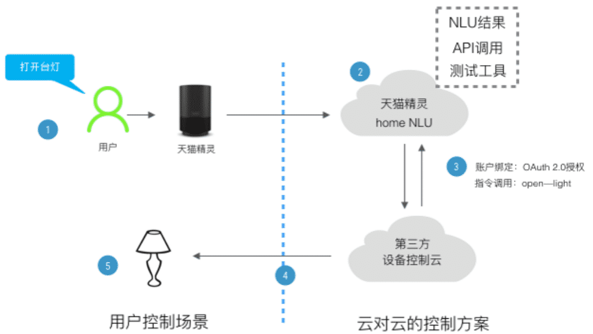

## 整体方案

天猫精灵协议的对接是云服务器与云服务器的对接，并不支持与硬件设备的直接对接。下图展示了智能硬件的接入方式：用户的语音指令通过天猫精灵上传阿里云语音服务器通过解析后发送响应的协议到云服务器，然后控制云再与硬件设备进行沟通控制。
<div align=center>

</div>
采用花生壳内网穿透的方法，部署一台ubuntu 16.04作为服务器。使用Apache2搭建一个web服务器用于解析域名和php文本，为域名申请SSL证书，部署Apahce2下的https服务器，安装MySQL数据库用于http协议下频繁的数据存储和查询读取和OAuth2.0服务器的搭建。AliGenie平台通过OAuth2.0在不需要注册新设备用户的同时使用用户已有的账号获得智能硬件的认证系统的授权，使得天猫精灵能够访问智能硬件，然后完成指令的交互。
<div align=center>

</div>
懒得搭服务器可以考虑下第三方平台，比如HomeAssistant、贝壳物联

## 准备
* 路由器
* 实验室主机一台
* 花生棒
* esp8266
* 天猫精灵

## 花生棒设置
访问https://b.oray.com/ 
内网穿透中增加两个映射
映射一
* 映射类型 HTTP80
* 外网端口 80
* 内网主机 192.168.1.241
* 内网端口 80
映射二
* 映射类型 通用应用
* 外网端口 动态端口号
* 内网主机 192.168.1.241
* 内网端口 443

## 服务器部署
### apache2+php7.0 web服务器的构建
安装apathe
``` bash
$ sudo apt-get install apache2
```
安装php
``` bash
$ sudo apt-get install php
```
配置apache2支持php7
``` bash
$ sudo apt-get install libapache2-mod-php
```
重启一下apache2
``` bash
$ sudo service apache2 restart
```

配置DPO
``` bash
$ sudo apt-get install php7.0-mysql
$ sudo phpenmod pdo_mysql
$ sudo service apache2 restart
```

``` bash
sudo vim /etc/php/7.0/mods-available/pdo.ini

    ;extension=pdo.so
```

``` bash
sudo vim /etc/php/7.0/apache2/php.ini

    extension=/usr/lib/php/20151012/mysqli.so
    extension=/usr/lib/php/20151012/mysqlnd.so
    extension=/usr/lib/php/20151012/pdo.so
    extension=/usr/lib/php/20151012/pdo_mysql.so
```


### 申请SSL证书
SSL For Free工具官方网站
* https://www.sslforfree.com/

输入域名点击后面的Create Free SSL Certificate按钮获取，选择手工验证方式Manual Verification，点击Manually Verify Domain，根据提示的步骤进行，下载文件，然后对应添加文件夹，然后激活验证链接
``` bash
$ cd /var/www/html/
$ sudo mkdir .well-known
$ cd .well-known/
$ sudo mkdir acme-challenge
$ cd acme-challenge/
$ sudo chmod 777 -R /var/www/html/
```
设置到期后通知邮箱，下载证书

### 部署HTTPS服务器
安装openssl
``` bash
$ sudo apt-get install openssl
```
开启SSL模块
``` bash
$ sudo a2enmod ssl
```
拷贝证书到相应目录，指定SSL证书

``` bash
SSLCertificateFile      /etc/ssl/certs/certificate.crt
SSLCertificateKeyFile   /etc/ssl/private/private.key
SSLCertificateChainFile /etc/ssl/private/ca_bundle.crt
```

``` bash
$ sudo chmod 777 -R /etc/ssl/
$ cd /etc/apache2/
$ cat ports.conf
    
    # If you just change the port or add more ports here, you will likely also
    # have to change the VirtualHost statement in
    # /etc/apache2/sites-enabled/000-default.conf

    Listen 80

    <IfModule ssl_module>
            Listen 443
    </IfModule>

    <IfModule mod_gnutls.c>
            Listen 443
    </IfModule>
```
建立软链
``` bash
$ sudo ln -s /etc/apache2/sites-available/default-ssl.conf /etc/apache2/sites-enabled/
```
修改default-ssl.conf
``` bash
$ sudo apt-get install vim
$ sudo vim /etc/apache2/sites-available/default-ssl.conf

    SSLProtocol all -SSLv2 -SSLv3
    SSLCertificateFile      /etc/ssl/certs/certificate.crt
    SSLCertificateKeyFile   /etc/ssl/private/private.key
    SSLCertificateChainFile /etc/ssl/private/ca_bundle.crt
```

通过a2ensite激活站点
``` bash
$ sudo a2ensite default-ssl.conf
```
重启apache
``` bash
$ sudo service apache2 restart
```
### 安装MySQL
``` bash
$ sudo apt-get install mysql-server mysql-client
```
下载安装oauth2-server
``` bash
$ cd /var/www/html/
$ sudo apt-get install git
$ git clone https://github.com/bshaffer/oauth2-server-php.git -b                                          master
```
建立数据库
``` bash
$ mysql -u root -p
```

``` bash
mysql> create database ilamp;
mysql> use ilamp;
mysql> CREATE TABLE `oauth_access_tokens` (
         `access_token` VARCHAR(40) NOT NULL,
         `client_id`    VARCHAR(80) NOT NULL,
         `user_id`  VARCHAR(255),
         `expires` TIMESTAMP NOT NULL,
         `scope` VARCHAR(2000),
         PRIMARY KEY (access_token));
mysql>  CREATE TABLE `oauth_authorization_codes` (
         `authorization_code` VARCHAR(40) NOT NULL,
         `client_id` VARCHAR(80) NOT NULL,
         `user_id` VARCHAR(255),
         `redirect_uri` VARCHAR(2000),
         `expires` TIMESTAMP NOT NULL,
         `scope` VARCHAR(2000),
         'id_token' VARCHAR(1000),
         PRIMARY KEY (authorization_code));
mysql>  CREATE TABLE 'oauth_clients' (
         'client_id' VARCHAR(80) not null,
         'client_secret' VARCHAR(80), 
         'redirect_uri' VARCHAR(2000),
         'grant_types' VARCHAR(80),
         'scope' VARCHAR(4000),
         'user_id' VARCHAR(80), 
         PRIMARY KEY (client_id));
mysql>  CREATE TABLE `oauth_refresh_tokens` ( 
         `refresh_token` VARCHAR(40) NOT NULL,
         `client_id` VARCHAR(80) NOT NULL,
         `user_id` VARCHAR(255),
         `expires` TIMESTAMP NOT NULL,
         `scope` VARCHAR(2000),
         PRIMARY KEY (refresh_token));
mysql> CREATE TABLE `oauth_users` (
         `username` VARCHAR(255) NOT NULL,
         `password` VARCHAR(2000),
         `first_name` VARCHAR(255),
         `last_name` VARCHAR(255),
         PRIMARY KEY (username));
mysql> CREATE TABLE `oauth_scopes` (
         'scope' VARCHAR(80) not null,
         'is_default' boolean,
         PRIMARY KEY(scope));
mysql> CREATE TABLE `oauth_jwt` (
         'client_id' VARCHAR(80) not null,
         'subject' VARCHAR(80),
         'public_key' VARCHAR(2000) not null);
mysql> show tables;
+---------------------------+
| Tables_in_ilamp           |
+---------------------------+
| oauth_access_tokens       |
| oauth_authorization_codes |
| oauth_clients             |
| oauth_jwt                 |
| oauth_refresh_tokens      |
| oauth_scopes              |
| oauth_users               |
+---------------------------+
mysql> insert into oauth_clients (client_id, client_secret, redirect_uri ) values ("id","psw","https://open.bot.tmall.com/oauth/callback");
```

## 天猫精灵新加技能

登录开发者平台AliGenie - 语音开发者平台  https://open.aligenie.com/
发布新技能。

### 服务设置
OAuth2
* 账户授权连接: https://xxxx/authorize.php
* ClientID: id
* Client Secret: psw
* 跳转 URL: https://open.bot.tmall.com/oauth/callback
* Access Token URL: https://xxx/token.php
* 厂商登出 URL: 暂无描述

设备管理
* 开发者网关地址: https://xxx/gate.php
* 设备管理跳转连接: 暂无描述


### 开机跳过用户登录
打开 系统设置 中的 用户帐户;  
打开用户帐户设置窗口后，点击右上角的"解锁"按钮;  
将自动登录设置为“开启”。


## 参考博客
* esp8266对接天猫精灵（1）前言 - CSDN博客</br>https://blog.csdn.net/qq_35527832/article/details/79143899
* 天猫精灵接入HomeAssistant</br>https://weibo.com/ttarticle/p/show?id=2309404195482120392395
* GitHub - c1pher-cn/tmall-bot-x1: 天猫精灵智能家居技能对接homeassistant</br>https://github.com/c1pher-cn/tmall-bot-x1
* 【新提醒】天猫精灵接入HomeAssistant【智能家居技能接入，非webhook调用】 - 『HomeAssistant』智能硬件讨论区 - 『瀚思彼岸』» 智能家居第一站 - Hassbian.com</br>https://bbs.hassbian.com/thread-1862-1-1.html
* AliGenie开发者平台</br>http://doc-bot.tmall.com/support/hotProblemDetail.htm?spm=0.0.0.0.cTGpHI&id=332356&tagId=null