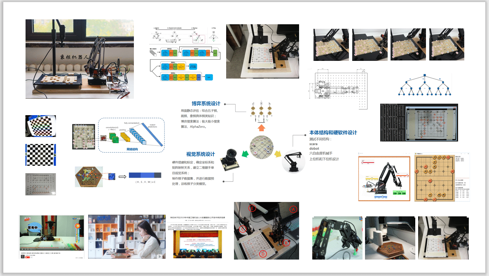
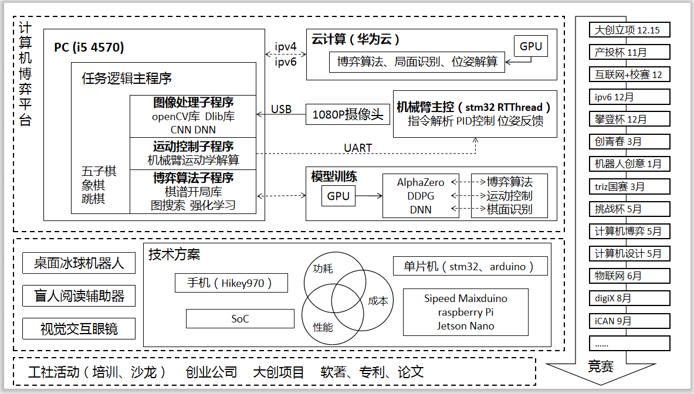
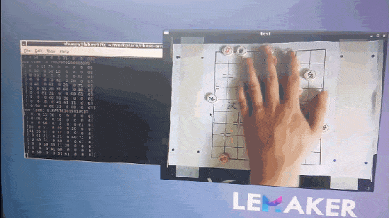
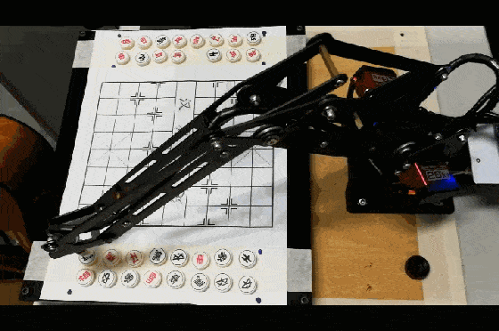
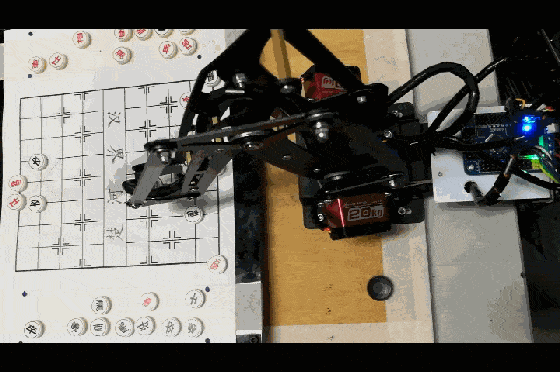
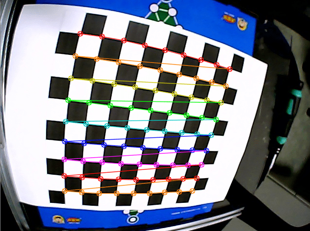
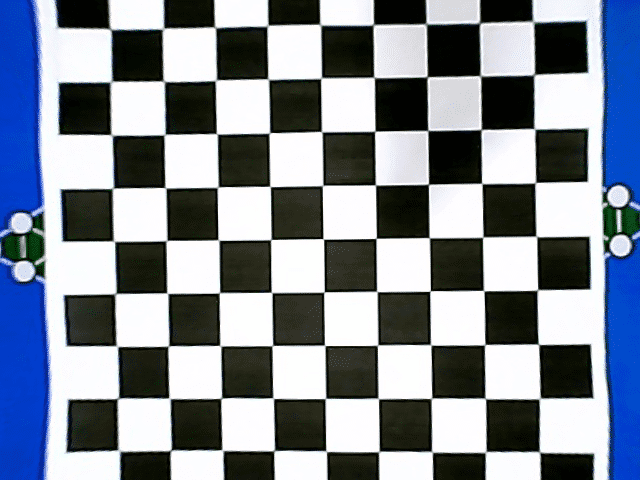
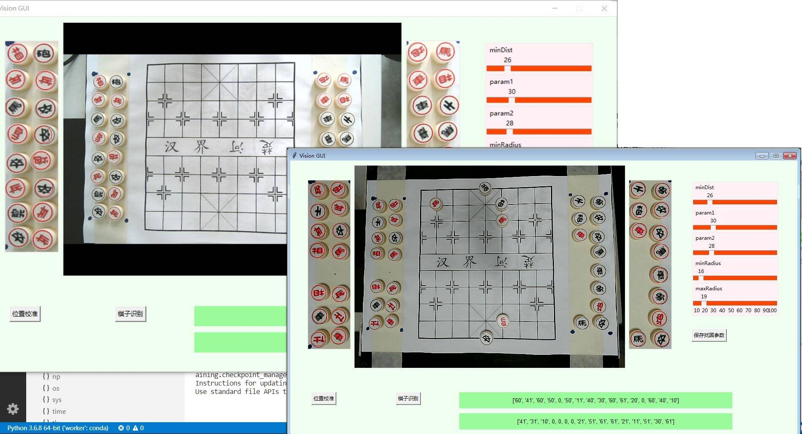
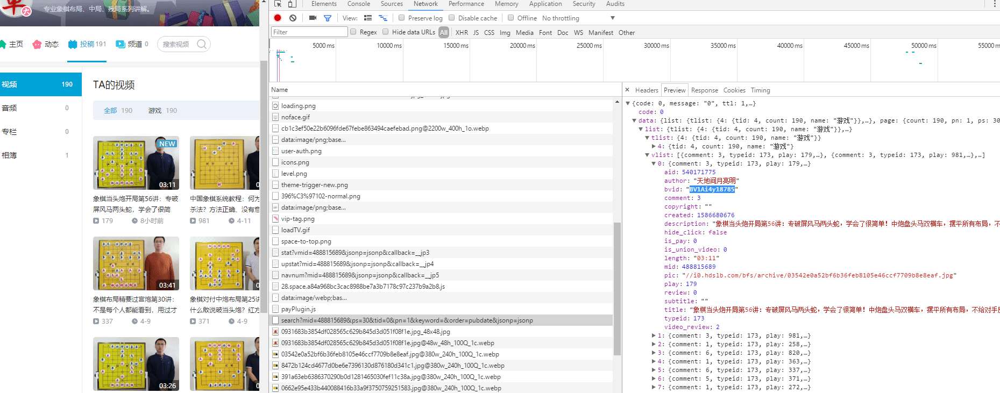

<div align=center>
<!--  -->

</div>


<div align=center>
<!--  -->

</div>

<!-- more -->
<The rest of contents | 余下全文>

# 准备

## python
* Home - Anaconda https://www.anaconda.com/  
* Visual Studio Code - Code Editing. Redefined https://code.visualstudio.com/  

```python
import cv2
import numpy
import tkinter as tk
import serial 
```

## Strategy
* 图搜索：极大极小搜索、Alpha-Beta剪枝、迭代加深、A*、IDA*
* 强化学习：MCTS、AlphaZero

## Armbot
* 越疆科技DOBOT https://cn.dobot.cc/

## Vision
* OpenCV: OpenCV-Python Tutorials https://docs.opencv.org/4.0.0/d6/d00/tutorial_py_root.html
* spmallick/learnopencv: Learn OpenCV : C++ and Python Examples https://github.com/spmallick/learnopencv
``` bash
> conda create -n your_env_name python=3.6
> activate your_env_name
> pip install opencv-python -i https://pypi.tuna.tsinghua.edu.cn/simple
> pip install opencv-contrib-python
```

# Demo

* hikey970 棋面识别  
<div align=center>
<!--  -->

</div>

* 开局  
<div align=center>
<!--  -->

</div>

* 人机对弈  
<div align=center>
<!--  -->

</div>


# 象棋残局机器人一：摄像头标定

廉价摄像头会给图像带来很多畸变，硬件解决方法是买个无畸变的摄像头，软件解决方案是找到摄像机畸变参数以及摄像机的内部参数和外部参数，对畸变图像进行修复。

<div align=center>

</div>

## 原理
* 相机标定(Camera calibration) - honyniu的专栏 - CSDN博客  
https://blog.csdn.net/honyniu/article/details/51004397
* 张正友相机标定Opencv实现以及标定流程&&标定结果评价&&图像矫正流程解析（附标定程序和棋盘图） - 牧野的博客 - CSDN博客  
https://blog.csdn.net/dcrmg/article/details/52939318


## 流程
1. 准备棋盘格标定图片；
2. 对每一张标定图片，执行棋盘格检测，提取角点信息；
3. 相机标定；
4. 对标定结果进行评价；
5. 查看标定效果

### 准备标定图片
标定图片需要使用标定板在不同位置、不同角度、不同姿态下拍摄，最少需要3张，以10~20张为宜。标定板需要是黑白相间的矩形构成的棋盘图，制作精度要求较高。


### 对每一张图片，提取角点信息
读取每一张标定图片，执行cv2.findChessboardCorners棋盘格检测函数，提取角点信息corners；  
我们需要最大精度的角点检测，使用cv2.cornerSubPix()，将角点的重心传给这个函数进行修正，它可以提供亚像素级别的角点检测；
在棋盘标定图上绘制找到的内角点；

``` python
def read_sample(self, image_path):
    for fname in image_path:
        img = cv2.imread(fname)
        gray = cv2.cvtColor(img, cv2.COLOR_BGR2GRAY)
        # 找到棋盘格角点
        ret, corners = cv2.findChessboardCorners(gray, (w,h),None)
        # 如果找到足够点对，将其存储起来
        if ret == True:
            cv2.cornerSubPix(gray,corners,(11,11),(-1,-1), self.criteria)
            self.objpoints.append(self.objp)
            self.imgpoints.append(corners)
            # 将角点在图像上显示
            cv2.drawChessboardCorners(img, (w,h), corners, ret)
            cv2.imshow('findCorners',img)
            cv2.waitKey(1)
    cv2.destroyAllWindows()
```
<div align=center>

</div>

### 相机标定
获取到棋盘标定图的内角点图像坐标之后，就可以使用cv2.calibrateCamera函数进行标定，计算相机内参和外参系数；
``` python
def calibrate(self):
    # 标定
    ret, mtx, dist, rvecs, tvecs = cv2.calibrateCamera( self.objpoints, self.imgpoints, self.image_shape[::-1], None, None)
    '''
    mtx   - 摄像机内矩阵
    dist  - 进一步扭曲
    rvecs - 旋转向量
    tvecs - 平移向量
    '''
    print("mtx:", mtx)
    print("dist:", dist)
```

### 查看标定效果
利用求得的内参数矩阵和畸变系数，可以对图像进行畸变的矫正
``` python
def test(self, image_path):
    # 去畸变
    img2 = cv2.imread(image_path)
    h, w = img2.shape[:2]
    # undistort
    dst = cv2.undistort(img2, self.calibrate_mtx, self.calibrate_dist, None, self.calibrate_mtx)
    cv2.imshow('img', img2)
    cv2.imshow('dst', dst)
```
<div align=center>

</div>

## 参考资料

* 使用OpenCV进行标定（Python） - sylvester的博客 - CSDN博客  
https://blog.csdn.net/u010128736/article/details/52875137

---
title: 象棋残局机器人二：投射变换
date: 2019-05-25 23:34:15
tags:
  - opencv
---

## 图片的几何变换
* 缩放
``` bash
img = cv2.imread("tmp.png", 1)
height, width, _ = img.shape  # (height, width, mode)
dstHeight = int(height*0.5)
dstWidth = int(width*0.5)
# cv2.resize()
# dst = cv2.resize(img, (dstWidth, dstHeight))
# 最近邻域插值
dstImage = np.zeros((dstHeight, dstWidth), np.uint8)
for i in range(0, dstHeight):
    for j in range(0, dstWidth):
        iNew = int(i * height * 1.0 / dstHeight)
        jNew = int(j * width * 1.0 / dstWidth)
        dstImage[i, j] = img(iNew, jNew)
cv2.imshow("img", dstImage)
# 双线性插值 
# 像素关系重采样 
# 立方插值
cv2.waitKey(0)
```
* 剪切
``` bash
# 图片坐标
# x: 0-width
# y: 0-height
img = cv2.imread("tmp.png", 1)
datImage = img[100:200, 100:300]
cv2.imshow("img", dstImage)
cv2.waitKey(0)
```
* 位移
``` bash
img = cv.imread("tmp.png", 1)
height, width, _ = img.shape  # (height, width, mode)
# cv2.warpAffine()
matShift = np.float32([[1,0,100], [0,1,200]]) # 2行3列
dstImage = cv2.warpAffine(img, matShift, (width, height))
cv2.imshow("img", dstImage)
cv2.waitKey(0)
```
* 镜像
``` bash
xImg  = cv.flip(img,1,dst=None)  #水平镜像
xImg1 = cv.flip(img,0,dst=None)  #垂直镜像
xImg2 = cv.flip(img,-1,dst=None) #对角镜像
```
* 仿射变换
``` bash
img = cv.imread("tmp.png", 1)
height, width, _ = img.shape  # (height, width, mode)
# src 3p -> dst 3p
matSrc = np.float32([[0,0], [0,height-1], [width-1, 0]])
matDst = np.float32([[50,50], [300,height-200], [width-300, 100]])
# 获得仿射变换矩阵
matAffine = cv2.getAffineTransform(matSrc, matDst)
dstImage = cv2.warpAffine(img, matAffine, (width, height))
cv2.imshow("img", dstImage)
cv2.waitKey(0)
```
* 旋转
``` bash
img = cv.imread("tmp.png", 1)
height, width, _ = img.shape  # (height, width, mode)
# 获得旋转矩阵
matRotate = cv2.getRotationMatrix2D((int(width/2), int(height/2)), 45, 0.5)
dstImage = cv2.warpAffine(img, matRotate, (width, height))
cv2.imshow("img2", dstImage)
cv2.waitKey(0)
```
## 仿射变换就是特殊的透射变换

* 透射变换
``` bash
matSrc = np.float32(points)
matDst = np.float32([[0,0],[0,399],[99, 0],[99,399]])
matPers = cv2.getPerspectiveTransform(matSrc, matDst)
dstImage = cv2.warpPerspective(img, matPers, (width, height))
```

<div align=center>

</div>

利用透射变换这一操作，从而将棋面的图像从背景中抽离转化成易于处理的形式。


## 参考资料

* 仿射变换和透射变换 - outthinker - 博客园  
https://www.cnblogs.com/zf-blog/p/7813227.html

* 4.1 图像特效介绍 - YouTube  
https://www.youtube.com/watch?v=Ih2iamhLvxE&list=PLsYXQooxlb1pE21-dgEf-VdsArdqSvuEW&index=36


# 象棋残局机器人三：分类模型retrain

基于InceptionV3和mobileNet模型重新训练自己的图片分类模型。


## 迁移学习

图片分类模型往往有数以万计的参数，而从头开始训练需要大量的带标签训练数据、强大的算力和更多时间，利用迁移学习，可以在前人优秀图片分类模型的基础上，非常快捷有效地重新训练出新的图像分类器。  
通常来说，迁移学习的策略有两种。
* Finetuning（微调）  
包括在基础数据集上使用预训练网络，并在目标数据集上训练所有层。
* Freeze and Train（冻结和训练）  
包括仅冻结并训练最后一层，其他层不变（权重不更新）；也可以冻结前几层，微调其他层，这是由于有些证据表明CNN的前几层有纹理滤镜和彩色斑点。

## 流程
1. predo.py，准备自己要分类的图片训练样本；
2. retrain.py，下载inception v3/mobileNet模型及训练图片分类器；
3. label_image.py，测试模型预测结果。

### 预处理
``` python
import os
import cv2

path = "./data"
files = os.listdir(path) 
# print(files)
for f in files: 
    print(f)
    cnt = 0
    data_list = os.listdir(path+'/'+f)
    # print(data_list[:4])
    for data in data_list:
        data_file_path = path+'/'+f+'/'+data 
        # img = cv2.imread(data_file_path)
        # img_resize = cv2.resize(img, (300, 300))
        # cv2.imwrite(path+'/'+f+'/'+"{:04d}.jpg".format(cnt), img_resize)
        newname = path+'/'+f+'/'+"{:04d}.jpg".format(cnt)
        os.rename(data_file_path, newname)
        cnt += 1
    #     if cnt == 2:
    #         break
    # break
```

### retrain
* tensorflow/retrain.py at c565660e008cf666c582668cb0d0937ca86e71fb · tensorflow/tensorflow  
https://github.com/tensorflow/tensorflow/blob/c565660e008cf666c582668cb0d0937ca86e71fb/tensorflow/examples/image_retraining/retrain.py

源码分析  
* TensorFlow学习笔记：Inception_v3源码分析 - 简书  
https://www.jianshu.com/p/feecdcdef8a0
``` bash
# By default: Inception v3
python retrain.py
# mobileNet
python retrain.py --image_dir ./data --architecture mobilenet_1.0_224
```
可以提前下载模型文件到./tmp/imagenet文件夹下。
* Google AI Blog: MobileNets: Open-Source Models for Efficient On-Device Vision  
https://ai.googleblog.com/2017/06/mobilenets-open-source-models-for.html

### 测试
``` python
import tensorflow as tf
import os
import numpy as np
import re
import shutil

lines = tf.gfile.GFile('./tmp/output_labels.txt').readlines()
uid_to_human = {}
#一行一行读取数据
for uid,line in enumerate(lines) :
    #去掉换行符
    line=line.strip('\n')
    uid_to_human[uid] = line
 
def id_to_string(node_id):
    if node_id not in uid_to_human:
        return ''
    return uid_to_human[node_id]
 
#创建一个图来存放google训练好的模型
with tf.gfile.FastGFile('./tmp/output_graph.pb', 'rb') as f:
    graph_def = tf.GraphDef()
    graph_def.ParseFromString(f.read())
    tf.import_graph_def(graph_def, name='')
 
with tf.Session() as sess:
    softmax_tensor = sess.graph.get_tensor_by_name('final_result:0')
    #遍历目录
    for root,dirs,files in os.walk('./test/'):
        # print("root[-1]:", root[-1]) # 类别
        # print("files:", files)
        
        for file in files:
            print(root+"/"+file)
            #载入图片
            image_data = tf.gfile.FastGFile(root+"/"+file, 'rb').read()
            predictions = sess.run(softmax_tensor,{'DecodeJpeg/contents:0': image_data})#图片格式是jpg格式
            predictions = np.squeeze(predictions)#把结果转为1维数据
 
            #打印图片路径及名称
            image_path = os.path.join(root,file)
            # print(image_path)
            # #显示图片
            # img=Image.open(image_path)
            # plt.imshow(img)
            # plt.axis('off')
            # plt.show()
 
            # 打印结果
            top_k = predictions.argsort()[::-1]
            # print(top_k)
            for node_id in top_k:     
                # 获取分类名称
                human_string = id_to_string(node_id)
                # 获取该分类的置信度
                score = predictions[node_id]
                print('%s (score = %.5f)' % (human_string, score))
            
            # 将识别错误文件保存到bad文件夹
            if id_to_string(top_k[0]) != root[-1]:
                old_path = root + "/" + file
                name, _ = file.split('.')
                new_path = r'./bad' + '/' + name + '_' + id_to_string(top_k[0]) + '_' + str(predictions[top_k[0]]) +'.jpg' 
                shutil.copyfile(old_path, new_path)

```

## 问题汇总
### 1. 使用mobileNet时 TypeError: Cannot interpret feed_dict key as Tensor: The name 'DecodeJpeg/contents:0' refers to a Tensor which does not exist. The operation, 'DecodeJpeg/contents', does not exist in the graph.

* TypeError: Cannot interpret feed_dict key as Tensor: The name 'DecodeJpeg/contents:0' refers to a Tensor which does not exist. The operation, 'DecodeJpeg/contents', does not exist in the graph. · Issue #12250 · tensorflow/tensorflow  
https://github.com/tensorflow/tensorflow/issues/12250

打印图的参数名称
``` python
tensor_name_list = [tensor.name for tensor in tf.get_default_graph().as_graph_def().node]
print(tensor_name_list)
```
修改输入为第一个tensor的名称
``` python
# inceptionV3
# image_data = tf.gfile.FastGFile(image_path, 'rb').read()
# predictions = sess.run(softmax_tensor, {'DecodeJpeg/contents:0': image_data}) #图片格式是jpg格式
# predictions = np.squeeze(predictions) #把结果转为1维数据

# mobileNet
image_data = tf.gfile.FastGFile(image_path, 'rb').read()
image_data = sess.run(tf.expand_dims(tf.image.resize_images(
    tf.image.decode_jpeg(image_data), [128, 128], method=np.random.randint(0,3)), 0))
predictions = sess.run(softmax_tensor, {'input:0': image_data}) #图片格式是jpg格式
predictions = np.squeeze(predictions) #把结果转为1维数据
```
### 2. 分类速度太慢： 0.8s一张图，32个棋子大概需要20多秒
对于棋子分类任务来说，输入是一张28*28的3通道图片，无论使用InceptionV3还是mobileNet_128模型都过于“厚重”，最终手写一个小的卷积网络，通过两层卷积+两层全连接来实现棋子分类。
<div align=center>

</div>
<div align=center>

</div>


## 参考资料

* 浅谈迁移学习图像分类 - weixin_33805743的博客 - CSDN博客  
https://blog.csdn.net/weixin_33805743/article/details/87426423


# 象棋残局机器人四：策略

关于下棋策略的方案，尝试使用了象棋引擎binghewusi和cyclone，最终选择开源项目cczero。


## 象棋引擎
* 中国象棋程序《象棋旋风》 </br>http://www.xqbase.com/league/xqcyclone.htm
* 中国象棋程序《兵河五四》 </br>http://www.xqbase.com/league/bhws.htm


### 中国象棋通用引擎协议
不管是Windows还是UNIX平台，能被界面调用的引擎都必须是编译过的可执行文件，它跟界面之间通过“标准输入”和“标准输出”(即C/C++语言中的stdin和stdout)通道来通讯。如果引擎从Windows平台移植到UNIX平台，那么需要重新编译源代码(管道操作的程序也需要作适当修改)，或使用跨平台接口。

* 中国象棋电脑应用规范(五)：中国象棋通用引擎协议</br>http://www.xqbase.com/protocol/cchess_ucci.htm

FEN格式串最初的棋局表示:
``` bash
rnbakabnr/9/1c5c1/p1p1p1p1p/9/9/P1P1P1P1P/1C5C1/9/RNBAKABNR w - - 0 1
```
小写表示黑方，大写表示红方  
* 中国象棋电脑应用规范(三)：FEN文件格式 </br>http://www.xqbase.com/protocol/cchess_fen.htm  

调用象棋引擎，输入FEN格式串表的当前局面，获得当前局面策略，输出的策略是一个ICCS坐标格式的四位字符串
``` bash
import subprocess
import time
class Strategy:
    exepath = r".\strategy.exe"

    def __init__(self):
        self.p = subprocess.Popen(self.exepath, stdin=subprocess.PIPE,stdout=subprocess.PIPE, stderr=subprocess.PIPE)
        ret = self.p.stdout.readline()

    def get_move(self, position = "rCbakabnr/9/1c5c1/p1p1p1p1p/9/9/P1P1P1P1P/4C2C1/9/RNBAKABNR", 
                 player = "b", times = 1000, depth = 8, show_thinking = 1):   
        
        com = "position fen " + position + " " + player + " - - 0 1\r\n"
        self.p.stdin.write(com.encode('GBK'))
        # com = 'go depth ' + str(depth) + ' time 20000\r\n'
        com = 'go depth ' + str(depth) + '\r\n'
        self.p.stdin.write(com.encode('GBK'))
        self.p.stdin.flush()

        while True:
            ret = self.p.stdout.readline()
            if show_thinking:
                print(ret)
            if ret.decode()[:8] == 'bestmove':
                ans = ret.decode()[9:13]
                break
        # print("ans", ans)
        return ans

if __name__ == '__main__':
    ai = Strategy()
    situation = "rnbakabnr/9/1c5c1/p1p1p1p1p/9/9/P1P1P1P1P/2C4C1/9/RNBAKABNR"
    move = ai.get_move(position=situation, show_thinking = True)
    print(move)

```
棋盘标记
<div align=center>

</div>


## 开源项目cczero

众所周知，Deep Mind公司先后推出了Alpha Go, AlphaGo Zero 和 AlphaZero 三个棋类算法：AlphaGo吊打李世石、柯洁；AlphaGo Zero不用人类知识从零学起吊打AlphaGo；AlphaZero又分别在围棋、国际象棋和将棋领域取得了最高水平。cczero项目移植了AlphaZero算法。  
DeepMind用了5000个TPU才能在很短的时间内训练完成，cczero也需要巨大的计算资源才能使其征服中国象棋打败当今最强象棋程序，其开放跑谱教程，鼓励参与者贡献CPU/GPU时间，使这个项目变得越来越强。    
cczero项目为开源项目，引擎和权重永久免费，项目交流群为706396552。

* 中国象棋Zero</br> https://cczero.org/
* NeymarL/ChineseChess-AlphaZero: Implement AlphaZero/AlphaGo Zero methods on Chinese chess. </br>https://github.com/NeymarL/ChineseChess-AlphaZero
* 下载cczero最新权重 </br>https://cczero.org/api/models


调用cczero主要代码
``` bash
play = PlayWithHuman(config)
# play.start(human_first)
play.env.reset(init_state="r8/3k5/9/9/9/9/9/9/4A4/3AK4")
play.load_model()
play.pipe = play.model.get_pipes()
play.ai = CChessPlayer(play.config, search_tree=defaultdict(VisitState), pipes=play.pipe,
                        enable_resign=False, debugging=False)
human_first = not args.ai_move_first
play.human_move_first = human_first
move = ai.get_move(position=situation, show_thinking = True)
```


## 参考资料
* AlphaZero实践——中国象棋（附论文翻译） - 知乎</br> https://zhuanlan.zhihu.com/p/34433581

# 象棋残局机器人五：象棋棋子分类模型

## 问题记录

### 1. 采集图像分辨率低导致分类错误

小伙伴的电脑摄像头采集视频流默认长宽比是16:9，显示的图片会自动在上下方补充两道黑条，并被发现无法通过cap.set(CAP_PROP_FRAME_HEIGHT，480)函数解决这个问题。  
这个问题导致采集图像的实际分辨率为640:360，所以采集的棋子照片中棋子比较模糊，同样的问题在重新调整摄像头位置没有调整好焦距时也会发生。
<div align=center>

</div>
默认分辨率是640*480，通过调高分辨率解决。  

``` bash
img = img[60:400,:,:]
img = cv2.resize(img, (640, 480))
```

### 2. 对于一些场景可以调整摄像头参数
特别注意有些摄像头参数设置后会保存，一旦修改后无法恢复到初始值，所以不要随意设置参数或在设置前注意记录摄像头参数的初始值。  
获取摄像头参数
``` bash
capture.get(CAP_PROP_FRAME_WIDTH)
capture.get(CAP_PROP_FRAME_HEIGHT)
capture.get(CAP_PROP_FPS)
capture.get(CAP_PROP_BRIGHTNESS)
capture.get(CAP_PROP_CONTRAST)
capture.get(CAP_PROP_SATURATION)
capture.get(CAP_PROP_HUE)
capture.get(CAP_PROP_EXPOSURE)
```
设置摄像头参数  
``` bash
capture.set(CAP_PROP_FRAME_WIDTH, 1080) #宽度 
capture.set(CAP_PROP_FRAME_HEIGHT, 960) #高度
capture.set(CAP_PROP_FPS, 30)           #帧率 帧/秒
capture.set(CAP_PROP_BRIGHTNESS, 1)     #亮度 1
capture.set(CAP_PROP_CONTRAST,40)       #对比度 40
capture.set(CAP_PROP_SATURATION, 50)    #饱和度 50
capture.set(CAP_PROP_HUE, 50)           #色调 50
capture.set(CAP_PROP_EXPOSURE, -6)      #曝光 50
```


# 象棋残局机器人六：robowork竞赛机械臂项目

竞赛组委会提供了Java工程Demo，这里记录一下部署过程。通过引用第三方象棋引擎，该机器人获得了中国工程机器人大赛暨国际公开赛的一等奖。

## Java 学习笔记

* https://github.com/Snailclimb/JavaGuide
* https://code.visualstudio.com/docs/languages/java


## VScode 搭建 Java 开发环境

* Writing Java with Visual Studio Code  
https://code.visualstudio.com/docs/java/java-tutorial


## 工程代码

* https://github.com/leebinjun/cchess-brobot-2019robowork


# 象棋残局机器人七：B站封面爬取残局数据集


## 步骤

* 下载封面图片
* 截取棋盘
* 识别局面信息

## 爬取B站视频封面

* b站封面提取_bilibili封面提取_av号封面提取  
http://www.galmoe.com/

* b站封面提取_bilibili封面提取_bv号封面提取
https://bilibili.huangyuehe.com/bilibili.html

``` python
# -*- coding: utf-8 -*-
import json
import requests

def request_download(img_url):
    import requests
    r = requests.get(img_url)
    with open('./data/tmp.png', 'wb') as f:
        f.write(r.content) 

# bv = input('请输入BV号')
bv = ""
url = "http://www.galmoe.com/t.php?aid=%s" % (bv,)

headers = {
    'User-Agent': 'Mozilla/5.0 (Windows NT 10.0; Win64; x64) AppleWebKit/537.36 (KHTML, like Gecko) Chrome/75.0.3770.100 Safari/537.36'
}

response = requests.get(url, headers=headers, verify=False)
# print(response.text)
# {"result":1,"url":"https://i2.hdslb.com/bfs/archive/b8cae05b0640ae50557285e57daeb03fa9fc8162.jpg"}
# {'result': 0}

# 获取到的是str字符串 需要解析成json数据
content = json.loads(response.text)

statue_code = content.get('result')
if statue_code == 1:
    img_url = content.get('url')
    request_download(img_url)
    print('封面图片下载完成')
else:
    print('该BV号不存在')
```




爬取up主老师视频的BV号
``` python
# -*- coding: utf-8 -*-
import requests
import re

def request_download(img_url, file_name="temp"):
    import requests
    r = requests.get(img_url)
    with open(f'./data/{file_name}.png', 'wb') as f:
        f.write(r.content) 

def get_bvid(url):
    headers = {
        'User-Agent': "Mozilla/5.0 (Windows NT 10.0; WOW64) AppleWebKit/537.36 (KHTML, like Gecko) Chrome/58.0.3029.110 Safari/537.36 SE 2.X MetaSr 1.0",
    }
    response = requests.get(url=url, headers=headers)
    # print(response.text)

    # 正则匹配得到BV号
    # "bvid":"BV117411P7gw",
    string = r'"bvid":"(.*?)",'
    pattern = re.compile(string)
    result = pattern.findall(response.text)

    # print(result)
    return result

if __name__ == "__main__":
    # test
    # page = 3
    # url = f"https://api.bilibili.com/x/space/arc/search?mid=488815689&ps=30&tid=0&pn={page}&keyword=&order=pubdate&jsonp=jsonp"
    # rst = get_bvid(url)
    # print(rst)
    
    for page in range(1, 8):
        url = f"https://api.bilibili.com/x/space/arc/search?mid=488815689&ps=30&tid=0&pn={page}&keyword=&order=pubdate&jsonp=jsonp"
        rst = get_bvid(url)
        print(rst)
```


爬取B站视频封面
``` python
# -*- coding: utf-8 -*-
import requests
import re

def request_download(img_url, file_name="temp"):
    import requests
    r = requests.get(img_url)
    with open(f'./data/{file_name}.png', 'wb') as f:
        f.write(r.content) 

def get_imgdata(bv_id):
    url = f"https://www.bilibili.com/video/{bv_id}"
    print(url)
    headers={
        'User-Agent': "Mozilla/5.0 (Windows NT 10.0; WOW64) AppleWebKit/537.36 (KHTML, like Gecko) Chrome/58.0.3029.110 Safari/537.36"
    }

    response = requests.get(url=url, headers=headers)
    # print(response.text)

    # 正则匹配得到封面图片网页
    # <meta data-vue-meta="true" itemprop="image" content="http://i2.hdslb.com/bfs/archive/b8cae05b0640ae50557285e57daeb03fa9fc8162.jpg">
    string = r'itemprop="image" content="(.*?)">'
    pattern = re.compile(string)
    result = pattern.findall(response.text)
    # print(result)

    # 下载图片
    if len(result) == 1:
        img_url = result[0]
        # print(img_url)
        request_download(img_url, file_name=bv_id)
        print('封面图片下载完成')
    else:
        print('该BV号不存在')

if __name__ == "__main__":
    # test
    # bv = "BV17z411b7AL"
    # get_imgdata(bv_id=bv)

    bv_list =  ['BV1EE411T79A', 'BV1JE411T7gU', 'BV1UE411g71T', 'BV12E411g7eu', 'BV11E411p7qM', 'BV19E411p7Gc', 'BV1KE411s7Z2', 'BV1rE411x7Gb', 'BV1bE411s7qY', 'BV18E411s7Aa', 'BV1KE41147EK', 'BV1KE41147T1', 'BV1sE411j7G1', 'BV1sE411j7hk', 'BV1pE411j7SS', 'BV1WE411j7cv', 'BV1PE411J7k1', 'BV1NE411J7JE', 'BV1UE411n7Jk', 'BV12E411n7a8', 'BV117411P7gw', 'BV117411P72s', 'BV1w7411K7h9', 'BV1p7411T7fd', 'BV1H7411T7EF', 'BV1P7411u7Wz', 'BV1A7411u7Fv', 'BV1Jj411f7XT', 'BV1nj411f7Kj', 'BV1nj411f7ba']
    for bv in bv_list:
        get_imgdata(bv_id=bv)
```

``` python
# -*- coding: utf-8 -*-
from get_bvid import get_bvid
from get_img import get_imgdata


for page in range(1, 8):
    url = f"https://api.bilibili.com/x/space/arc/search?mid=488815689&ps=30&tid=0&pn={page}&keyword=&order=pubdate&jsonp=jsonp"
    bvid_list = get_bvid(url)
    print(bvid_list)
    for bv in bvid_list:
        get_imgdata(bv_id=bv)
```

