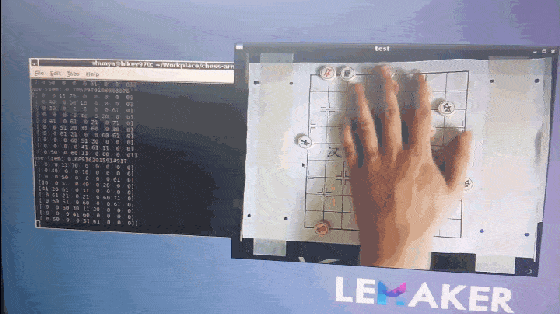
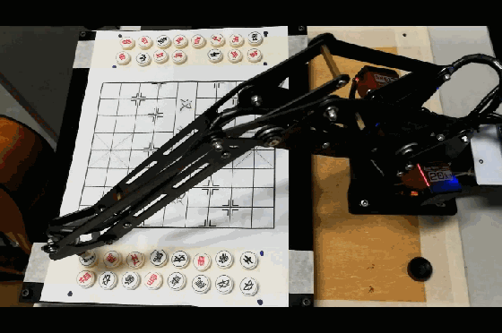
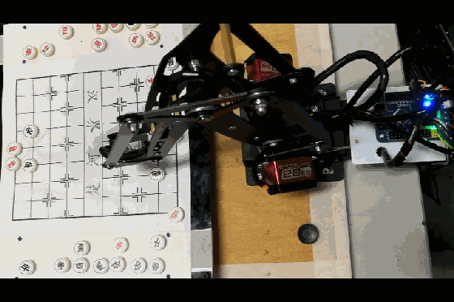

# 准备

## python
* Home - Anaconda https://www.anaconda.com/  
* Visual Studio Code - Code Editing. Redefined https://code.visualstudio.com/  

```python
import cv2
import numpy
import tkinter as tk
import serial 
```

## Strategy
* 图搜索：极大极小搜索、Alpha-Beta剪枝、迭代加深、A*、IDA*
* 强化学习：MCTS、AlphaZero

## Armbot
* 越疆科技DOBOT https://cn.dobot.cc/

## Vision
* OpenCV: OpenCV-Python Tutorials https://docs.opencv.org/4.0.0/d6/d00/tutorial_py_root.html
* spmallick/learnopencv: Learn OpenCV : C++ and Python Examples https://github.com/spmallick/learnopencv
``` bash
> conda create -n your_env_name python=3.6
> activate your_env_name
> pip install opencv-python -i https://pypi.tuna.tsinghua.edu.cn/simple
> pip install opencv-contrib-python
```


# Demo


* hikey970 棋面识别  
<div align=center>

</div>

* 开局  
<div align=center>

</div>

* 人机对弈  
<div align=center>

</div>

