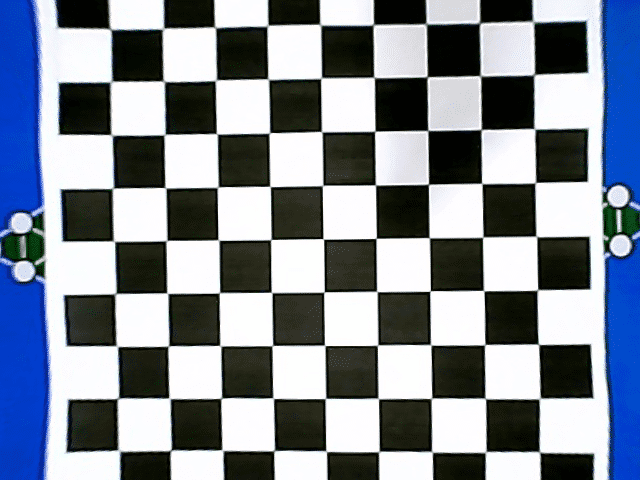

** {{ title }}：** <Excerpt in index | 首页摘要>
廉价摄像头会给图像带来很多畸变，硬件解决方法是买个无畸变的摄像头，软件解决方案是找到摄像机畸变参数以及摄像机的内部参数和外部参数，对畸变图像进行修复。
<!-- more -->
<The rest of contents | 余下全文>

<div align=center>

</div>

## 原理
* 相机标定(Camera calibration) - honyniu的专栏 - CSDN博客 </br>https://blog.csdn.net/honyniu/article/details/51004397
* 张正友相机标定Opencv实现以及标定流程&&标定结果评价&&图像矫正流程解析（附标定程序和棋盘图） - 牧野的博客 - CSDN博客</br>https://blog.csdn.net/dcrmg/article/details/52939318


## 流程
1. 准备棋盘格标定图片；
2. 对每一张标定图片，执行棋盘格检测，提取角点信息；
3. 相机标定；
4. 对标定结果进行评价；
5. 查看标定效果

### 准备标定图片
标定图片需要使用标定板在不同位置、不同角度、不同姿态下拍摄，最少需要3张，以10~20张为宜。标定板需要是黑白相间的矩形构成的棋盘图，制作精度要求较高。


### 对每一张图片，提取角点信息
读取每一张标定图片，执行cv2.findChessboardCorners棋盘格检测函数，提取角点信息corners；  
我们需要最大精度的角点检测，使用cv2.cornerSubPix()，将角点的重心传给这个函数进行修正，它可以提供亚像素级别的角点检测；
在棋盘标定图上绘制找到的内角点；

``` bash
def read_sample(self, image_path):
    for fname in image_path:
        img = cv2.imread(fname)
        gray = cv2.cvtColor(img, cv2.COLOR_BGR2GRAY)
        # 找到棋盘格角点
        ret, corners = cv2.findChessboardCorners(gray, (w,h),None)
        # 如果找到足够点对，将其存储起来
        if ret == True:
            cv2.cornerSubPix(gray,corners,(11,11),(-1,-1), self.criteria)
            self.objpoints.append(self.objp)
            self.imgpoints.append(corners)
            # 将角点在图像上显示
            cv2.drawChessboardCorners(img, (w,h), corners, ret)
            cv2.imshow('findCorners',img)
            cv2.waitKey(1)
    cv2.destroyAllWindows()
```
<div align=center>

</div>

### 相机标定
获取到棋盘标定图的内角点图像坐标之后，就可以使用cv2.calibrateCamera函数进行标定，计算相机内参和外参系数；
``` bash
def calibrate(self):
    # 标定
    ret, mtx, dist, rvecs, tvecs = cv2.calibrateCamera( self.objpoints, self.imgpoints, self.image_shape[::-1], None, None)
    '''
    mtx   - 摄像机内矩阵
    dist  - 进一步扭曲
    rvecs - 旋转向量
    tvecs - 平移向量
    '''
    print("mtx:", mtx)
    print("dist:", dist)
```

### 查看标定效果
利用求得的内参数矩阵和畸变系数，可以对图像进行畸变的矫正
``` bash
def test(self, image_path):
    # 去畸变
    img2 = cv2.imread(image_path)
    h, w = img2.shape[:2]
    # undistort
    dst = cv2.undistort(img2, self.calibrate_mtx, self.calibrate_dist, None, self.calibrate_mtx)
    cv2.imshow('img', img2)
    cv2.imshow('dst', dst)
```
<div align=center>

</div>

## 参考资料

* 使用OpenCV进行标定（Python） - sylvester的博客 - CSDN博客 </br>https://blog.csdn.net/u010128736/article/details/52875137

