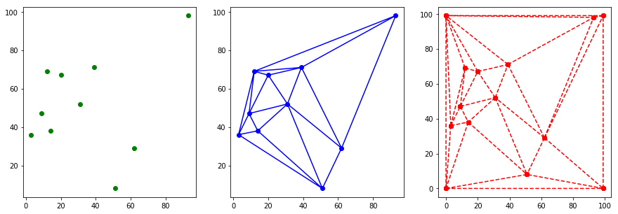
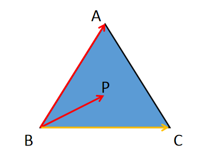
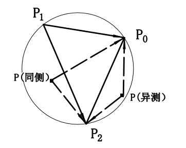

** {{ title }}：** <Excerpt in index | 首页摘要>

##  Voronoi diagram 维诺图 和 Delaunay Triangulation 德罗奈三角剖分

<!-- more -->
<The rest of contents | 余下全文>


### 维诺图

#### 定义
给定平面中的一组点，所有点不共线，维诺图为每个点（生成元）创建多边形区域，使得每个区域中的点到生成元的距离最近。  

#### 特点 
* 每个V多边形内有一个生成元； 
* 每个V多边形内点到该生成元距离短于到其它生成元距离； 
* 多边形边界上的点到生成此边界的生成元距离相等（生成元连线的垂直平分线）； 
* 邻接图形的Voronoi多边形界线以原邻接界线作为子集。

### 德罗奈三角剖分

对点集进行结构化的一个重要的方法就是对这些点进行三角剖分。
#### 定义
Delaunay三角剖分定义为平面上的点集P是一种三角剖分，使得P中没有点严格处于剖分后中任意一个三角形外接圆的内部。

#### 特点
* Delaunay三角剖分与Voronoi图是对偶关系。  
  对于一个维诺图，若任何两个生成元site之间有一条非空边界，那么这两个site之间连接一条边，由此得到的对偶图，就是一个三角剖分。
* 空圆性  
  对于Delaunay剖分中的任何一张face的外接圆必然是空的。 
* 最近邻性  
  任何一条连接于最近邻之间的边都会被Delaunay剖分所采用，因为这里头会存在一个以这条边为直径（弦）的空圆。
* 复杂度  
  在二维平面中，每增加一个点三角形的数目都会大概增加2，边数增加3。可以说在二维上的Delaunay剖分中是一个线性规模的数据结构。但在三维的情况下这两个指标最多会达到平房的量级，更高维的空间的一般结论也会达到2^d量级。
 
 


### 维诺图生成方法

首先生成其对偶元Delaunay三角网，再找出三角网每一三角形的外接圆圆心，最后连接相邻三角形的外接圆圆心，形成以每一个三角形顶点为生成元的多边形网。

步骤：  
（1）离散点自动构建三角网，即构建Delaunay三角网。对离散点和形成的三角形编号，记录每个三角形是由哪三个离散点构成的。   
（2）计算每个三角形的外接圆圆心，并记录之。   
（3）遍历三角形链表，寻找与当前三角形pTri三边共边的相邻三角形TriA，TriB和TriC。   
（4）如果找到，则把寻找到的三角形的外心与pTri的外心连接，存入维诺边链表中。如果找不到，则求出最外边的中垂线射线存入维诺边链表中。   
（5）遍历结束，所有维诺边被找到，根据边画出维诺图。

Delaunay剖分是一种三角剖分的标准，实现它有多种算法，这里采用Bowyer-Watson算法，算法的基本步骤是：   
（1）构造一个超级三角形，包含所有散点，放入三角形链表。   
（2）将点集中的散点依次插入，在三角形链表中找出其外接圆包含插入点的三角形（称为该点的影响三角形），删除影响三角形的公共边，将插入点同影响三角形的全部顶点连接起来，从而完成一个点在Delaunay三角形链表中的插入。   
（3）根据优化准则对局部新形成的三角形进行优化。将形成的三角形放入Delaunay三角形链表。   
（4）循环执行上述第2步，直到所有散点插入完毕。


```python
from random import randint, seed
from math import ceil, sqrt, log, floor

import delaunay as D
```


```python
# 随机生成20个点
seed(4)
n = 10
xs = [randint(1, 98) for x in range(n)]
ys = [randint(1, 98) for x in range(n)]
zs = [0 for x in range(n)]

DT = D.Delaunay_Triangulation()
for x, y in zip(xs, ys):
    DT.AddPoint(D.Point(x, y))

XS, YS, TS = DT.export()

# print(XS)
# print(YS)
# print(TS)

"""
Creating and plotting unstructured triangular grids.
"""
import matplotlib.pyplot as plt
import matplotlib.tri as tri
import math

%matplotlib inline

plt.figure(figsize=(15,5))

plt.subplot(1,3,1)
plt.plot(xs, ys, 'go')

# Creating a Triangulation without specifying the triangles results in the
# Delaunay triangulation of the points.

# Create the Triangulation; no triangles so Delaunay triangulation created.
triang = tri.Triangulation(xs, ys)

# Plot the triangulation.
plt.subplot(1,3,2)
plt.triplot(triang, 'bo-')

plt.subplot(1,3,3)
plt.triplot(tri.Triangulation(XS, YS, TS), 'ro--')

plt.show()

```




### 参考资料
* 计算几何笔记 - 知乎  
https://zhuanlan.zhihu.com/c_162517931 
* Delaunay Triangulation - menjiawan的专栏 - CSDN博客  
https://blog.csdn.net/menjiawan/article/details/45073121

### Bowyer-Watson算法

__Bowyer算法__由英国Bath大学的Bowyer在1981年提出。算法首先构造离散点集的的若干离散点的Voronoi图，根据Voronoi领域准则连接临近点，得到初始Delaunay三角剖分，然后逐步加入剖分点，每加入一个点就对已有的Voronoi图进行修改，构造新点集的Voronoi图，直到所有点都插入完毕。
* Computing Dirichlet tessellations1 | The Computer Journal | Oxford Academic  
https://academic.oup.com/comjnl/article/24/2/162/338193

__Watson算法__由澳大利亚悉尼大学Watson在1981年提出。算法采用空外接圆准则，直接从三角剖分入手。算法从初始三角划分开始，每加入一个离散点，找出所有外接圆包含此点的三角形，删除这些三角形面向该插入点的边，得到包含此点的多边形，将此点与多边形的定点连接就构成新的Delaunay三角剖分，重复此过程直至所有点插入完毕为止。注意，此算法当四点或以上共圆时将产生错误。
* Computing the n-dimensional Delaunay tessellation with application to Voronoi polytopes1 | The Computer Journal | Oxford Academic  
https://academic.oup.com/comjnl/article/24/2/167/338200

__Bowyer-Watson算法__是根据上述两者算法相互补充改进得到的(貌似跟Watson算法差不多，具体可以参考上述两篇论文)，仍然是一种插点增量算法的一种。算法逻辑如下：

- 1.求解离散点集的凸包，建立点集凸包边界节点的初始三角形划分；
- 2.选择另外的离散点，插入指定位置，在已有的三角形中找出外接圆包含此点的三角形，并删除公共边，得到一个包含新插入点的多边形；
- 3.将此点与多边形的其他顶点连接起来，构成新的三角形划分；
- 4.重复插点知道所有点插入完毕。
- 5.最后删除超级三角形相关联的三角形即可。


### 判断点在三角形内




#### 1. 点P和三顶点夹角和360
连接点P和三角形的三个顶点得到三条线段PA，PB和PC，求出这三条线段与三角形各边的夹角，如果所有夹角之和为360度，那么点P在三角形内，否则不在，此法直观，但效率低下。

#### 2. 依次选定三边，点P和另一顶点在同一侧:两个外积同号，那么点在一侧
当选定线段AB时，点C位于AB的右侧，同理选定BC时，点A位于BC的右侧，最后选定CA时，点B位于CA的右侧，所以当选择某一条边时，我们只需验证点P与该边所对的点在同一侧即可。  
如何判断两个点在某条线段的同一侧呢？可以通过叉积来实现，连接BP，将BP和BC做叉积，再将BA和BC做叉积，如果两个叉积的结果方向一致，那么两个点在同一侧。  
BTW，判断两个向量的是否同向可以用点积实现，如果点积大于0，则两向量夹角是锐角，否则是钝角。

#### 3. 利用外积同号和面积关系
首先利用外积方向判断p在角ABC内：将BA和BC做叉积，连接BP，分别将BA和BP、BP和BC做叉积并判断与BA和BC的叉积同向。
最后利用外积大小判断p在三角形ABC内：BA和BP、BP和BC的叉积之和，小于BA和BC的叉积。

### 判断点在三角形的外接圆内

#### 1.先求圆心、半径，比较半径和圆心到点P距离


由三角形的外心坐标公式计算圆心坐标
$$
x=\frac{\left|\begin{array}{lll}{x_{0}^{2}+y_{0}^{2}} & {y_{0}} & {1} \\ {x_{1}^{2}+y_{1}^{2}} & {y_{1}} & {1} \\ {x_{2}^{2}+y_{2}^{2}} & {y_{2}} & {1}\end{array}\right|}{2\left|\begin{array}{ccc}{x_{0}} & {y_{0}} & {1} \\ {x_{1}} & {y_{1}} & {1} \\ {x_{2}} & {y_{2}} & {1}\end{array}\right|} , y=\frac{\left|\begin{array}{lll}{x_{0}} & {x_{0}^{2}+y_{0}^{2}} & {1} \\ {x_{1}} & {x_{1}^{2}+y_{1}^{2}} & {1} \\ {x_{2}} & {x_{2}^{2}+y_{2}^{2}} & {1}\end{array}\right|}{2\left|\begin{array}{ccc}{x_{0}} & {y_{0}} & {1} \\ {x_{1}} & {y_{1}} & {1} \\ {x_{2}} & {y_{2}} & {1}\end{array}\right|}
$$
根据这个外心的坐标公式计算出外接圆的圆心坐标，就能得到圆的半径，从而判断出点P与外接圆的位置关系。

#### 2.利用角度关系


- step1 计算$∠P_0P_1P_2$和$∠P_0PP_2$的大小，两个角的大小在$[0,π]$范围内。  
    - step1.1 如果$∠P_0PP_2=0$，则点$P$不在圆内，结束；如果$∠P_0PP_2 = π$,则点$P$在圆内，结束。   
   
   
- setp2 判断点$P$和$P_1$是否在$P_0P_2$同侧。  
    - step2.1 这里通过判断向量外积 $\overrightarrow{P_{1} P_{0}} \times \overrightarrow{P_{1} P_{2}}$与$\overrightarrow{P P_{0}} \times \overrightarrow{P P_{2}}$ 是否同号，如果同号则在同一侧，否则在两侧。   


- step3 如果点$P$和$P_1$是在$P_0P_2$同一侧，若$\angle P_{0} P_{1} P_{2} \leq \angle P_{0} P P_{2}$,则点$P$在圆内，否则在圆外，结束；如果点$P$和$P_1$是在$P_0P_2$不在侧，若$\angle P_{0} P_{1} P_{2}+\angle P_{0} P P_{2} \geq \pi$，则点$P$在圆内，否则在圆外，结束。


### Delaunay Triangulation & Voronoi Diagram in OpenCV

给定一组点，可以使用openCV中的Subdiv2D类计算Delaunay三角剖分或Voronoi图。

步骤：
- 1.获取关键点列表
> points = []  
> points.append((x, y))
- 2.定义要分区的矩形区间
> img = cv2.imread("image.jpg");
> size = img.shape
> rect = (0, 0, size[1], size[0])
- 3.创建Subdiv2D类的实例
> subdiv  = cv2.Subdiv2D(rect)
- 4.使用subdiv.insert(point)插入点
> for p in points :
>     subdiv.insert(p)
- 5.使用subdiv.getTriangleList方法得到Delaunay三角剖分的三角形列表
> triangleList = subdiv.getTriangleList();
> for t in triangleList :
>     pt1 = (t[0], t[1])
>     pt2 = (t[2], t[3])
>     pt3 = (t[4], t[5])
- 6.使用subdiv.getVoronoiFacetList方法得到Voronoi图形状和中心的列表
> (facets, centers) = subdiv.getVoronoiFacetList([])


```python
import cv2
import numpy as np
import random

# Check if a point is inside a rectangle
def rect_contains(rect, point) :
    if point[0] < rect[0] :
        return False
    elif point[1] < rect[1] :
        return False
    elif point[0] > rect[2] :
        return False
    elif point[1] > rect[3] :
        return False
    return True

# Draw a point
def draw_point(img, p, color ) :
    cv2.circle( img, p, 2, color, cv2.FILLED, cv2.LINE_AA, 0 )

# Draw delaunay triangles
def draw_delaunay(img, subdiv, delaunay_color ) :
    triangleList = subdiv.getTriangleList();
    size = img.shape
    r = (0, 0, size[1], size[0])

    for t in triangleList :
        pt1 = (t[0], t[1])
        pt2 = (t[2], t[3])
        pt3 = (t[4], t[5])
        
        if rect_contains(r, pt1) and rect_contains(r, pt2) and rect_contains(r, pt3) :
            cv2.line(img, pt1, pt2, delaunay_color, 1, cv2.LINE_AA, 0)
            cv2.line(img, pt2, pt3, delaunay_color, 1, cv2.LINE_AA, 0)
            cv2.line(img, pt3, pt1, delaunay_color, 1, cv2.LINE_AA, 0)

# Draw voronoi diagram
def draw_voronoi(img, subdiv) :

    ( facets, centers) = subdiv.getVoronoiFacetList([])

    for i in range(0,len(facets)) :
        ifacet_arr = []
        for f in facets[i] :
            ifacet_arr.append(f)
        
        ifacet = np.array(ifacet_arr, np.int)
        color = (random.randint(0, 255), random.randint(0, 255), random.randint(0, 255))

        cv2.fillConvexPoly(img, ifacet, color, cv2.LINE_AA, 0);
        ifacets = np.array([ifacet])
        cv2.polylines(img, ifacets, True, (0, 0, 0), 1, cv2.LINE_AA, 0)
        cv2.circle(img, (centers[i][0], centers[i][1]), 3, (0, 0, 0), cv2.FILLED, cv2.LINE_AA, 0)


if __name__ == '__main__':

    # Define window names
    win_delaunay = "Delaunay Triangulation"
    win_voronoi = "Voronoi Diagram"

    # Turn on animation while drawing triangles
    animate = True
    
    # Define colors for drawing.
    delaunay_color = (255,255,255)
    points_color = (0, 0, 255)

    # Read in the image.
    img = cv2.imread("./images/obama.jpg");
    
    # Keep a copy around
    img_orig = img.copy();
    
    # Rectangle to be used with Subdiv2D
    size = img.shape
    rect = (0, 0, size[1], size[0])
    
    # Create an instance of Subdiv2D
    subdiv = cv2.Subdiv2D(rect);

    # Create an array of points.
    points = [];
    
    # Read in the points from a text file
    with open("./images/obama.txt") as file :
        for line in file :
            x, y = line.split()
            points.append((int(x), int(y)))

    # Insert points into subdiv
    for p in points :
        subdiv.insert(p)
        
        # Show animation
        if animate :
            img_copy = img_orig.copy()
            # Draw delaunay triangles
            draw_delaunay( img_copy, subdiv, (255, 255, 255) );
            cv2.imshow(win_delaunay, img_copy)
            cv2.waitKey(100)

    # Draw delaunay triangles
    draw_delaunay( img, subdiv, (255, 255, 255) );

    # Draw points
    for p in points :
        draw_point(img, p, (0,0,255))

    # Allocate space for voronoi Diagram
    img_voronoi = np.zeros(img.shape, dtype = img.dtype)

    # Draw voronoi diagram
    draw_voronoi(img_voronoi,subdiv)

    # Show results
    cv2.imshow(win_delaunay,img)
    cv2.imshow(win_voronoi,img_voronoi)
    cv2.waitKey(0)


```

### 参考博客
* Facial Landmark Detection | Learn OpenCV  
https://www.learnopencv.com/facial-landmark-detection/
* Delaunay Triangulation and Voronoi Diagram using OpenCV ( C++ / Python ) | Learn OpenCV  
https://www.learnopencv.com/delaunay-triangulation-and-voronoi-diagram-using-opencv-c-python/


