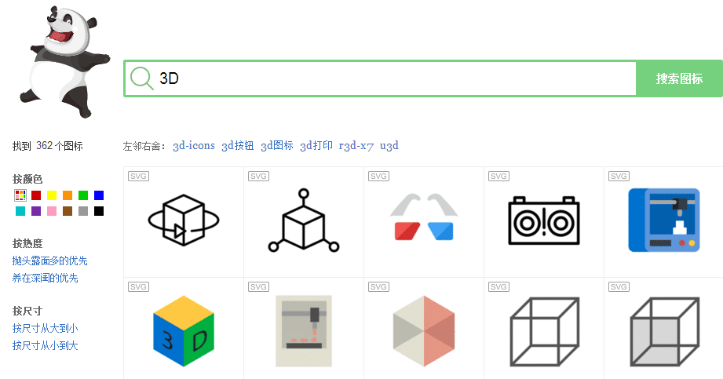
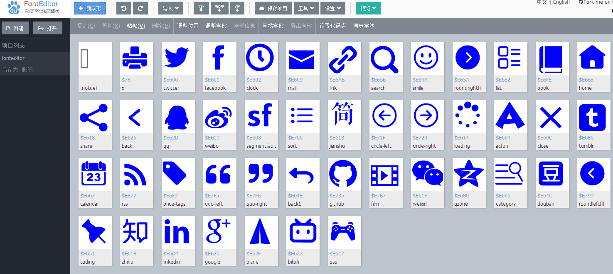
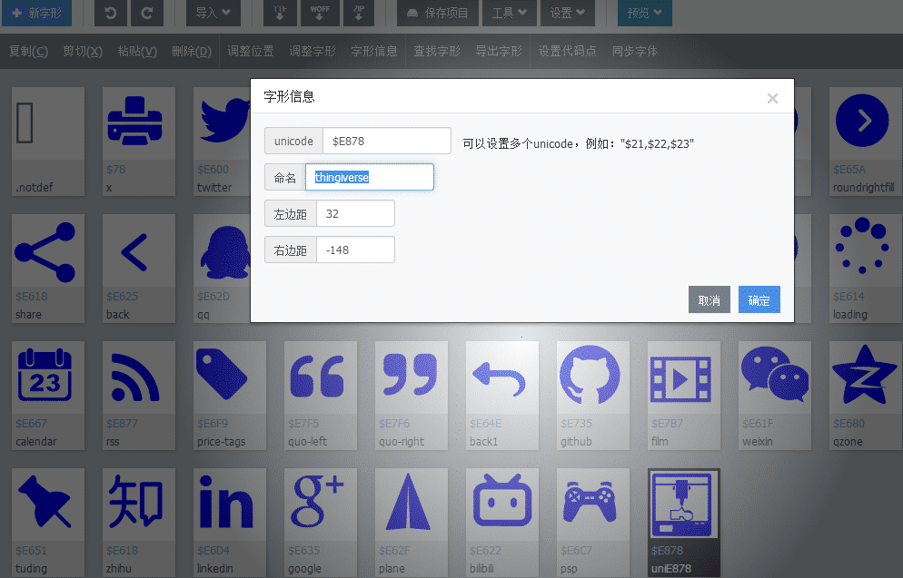
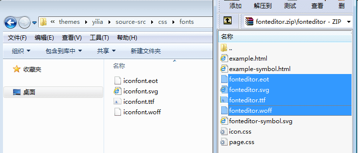

## 准备素材

搜索想要使用的图标，下载png格式文件
* 图标下载，ICON(SVG/PNG/ICO/ICNS)图标搜索下载 - Easyicon  
https://www.easyicon.net/
* Font Awesome  
https://fontawesome.com/

<div align=center>

</div>

拷贝xxx.github.io\themes\yilia\source-src\css\fonts下的iconfont.svg文件到桌面  

使用百度字体平台，制作图标  
* 百度字体平台  
http://fontstore.baidu.com/store#!/

进入“FontEdior”并“新建”新项目，点击“导入”选择“导入svg”，将iconfont.svg文件导入进来。  

导入完成后，会出现yilia自带的图标文字。
<div align=center>

</div>

再次点击“导入”选择“导入图片”，导入下载好的png格式图标。

对图片大小和位置进行调整，保存并退出。

选中编辑好的图标，点击“字形信息”，输入Unicode和名字，并记下来之后会用到。
<div align=center>

</div>

点击“保存项目”，下载fonteditor.zip文件，制作完成。

## 配置Hexo

解压下载下来的fonteditor.zip文件，将.eot，.svg，.ttf，.woff四个文件拷贝到xxx.github.io\themes\yilia\source-src\css\fonts文件夹下，重命名并替换原文件
<div align=center>

</div>

编辑xxx.github.io\themes\yilia\source-src\css目录下的font.scss和social.scss文件。

在font.scss中，直接添加.icon-{your App}:before{ content: "{your unicode}"}。 
``` scss
.icon-thingiverse:before { content: "\e878"; }
```

在social.scss中，也很简单，添加颜色即可。

``` scss
        a.thingiverse {
            background: #086ef6;
            border:1px solid #086ef6;
            &:hover {
                border:1px solid #086ef6;
            }
        }
```

在xxx.github.io\themes\yilia目录下，运行

``` bash
xxx.github.io\themes\yilia>npm install
>npm run dev
>npm run dist
```

回到博客根目录
``` bash
hexo g 
hexo s
```
完成。

## 问题记录
### 1. npm ERR! Unexpected end of JSON input while parsing near    

清一下缓存。
``` bash
npm cache clean --force
```

### 2. npm ERR! node-sass

先卸载，再重装，或者重建。
``` bash
npm uninstall node-sass
npm install node-sass
npm rebuild node-sass
```

## 参考博客

* Hexo yilia 主题一揽子使用方案 - YunShell - CSDN博客   
https://blog.csdn.net/lynnbest/article/details/79845944

* 【Hexo】yilia主题 添加 Subnav 社交图标 CSDN STEAM PSN等等 - csdn_inside的博客 - CSDN博客  
https://blog.csdn.net/csdn_inside/article/details/89159803

