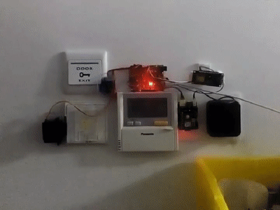

title: 门禁Arduino下位机通信与舵机控制
date: 2019-07-12 17:03:45
tags:

** {{ title }} ** <Excerpt in index | 首页摘要>

<div align=center>

</div>

<!-- more -->

<The rest of contents | 余下全文>

Arduino代码

```arduino
#include <Servo.h>
Servo myservo; // 定义舵机变量名
String comdata = "";

void setup() {
    Serial.begin(9600); // 初始化串口
    myservo.attach(9);  // 初始化舵机
}

void loop() {
    delay(2000);
    // 串口接收到数据就开门
    while(Serial.available() > 0)
    {
        comdata += char(Serial.read());
        delay(2);
        // Serial.println("get comdata");
        myservo.write(180); // 设置舵机旋转的角度，开门
        delay(500);
    }  
    myservo.write(70); // 舵机复位
    delay(500);
    comdata = ""; 
}
```

使用Visual Studio Code开发Arduino - 雪狼的博客 - CSDN博客 https://blog.csdn.net/zhaoxd200808501/article/details/78059627?locationNum=9&fps=1
3.使用Visual Studio Code+PlatformIO IDE开发Arduino - PIBOT导航机器人 - CSDN博客 https://blog.csdn.net/baimei4833953/article/details/78771611/

添加Arduino.path 不带.exe
PIO 注册一个账号


程序验证 上传
``

打开串口监视器
``

设置波特率
Ctrl+t
B
9600
Enter

VScode-PlatformIo插件之串口终端的使用 - qq_32955031的博客 - CSDN博客 https://blog.csdn.net/qq_32955031/article/details/83660850
